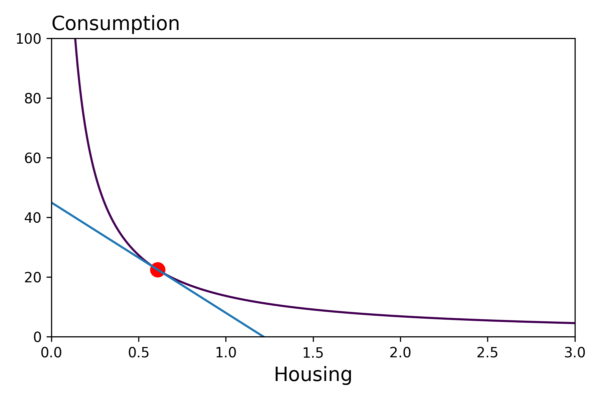
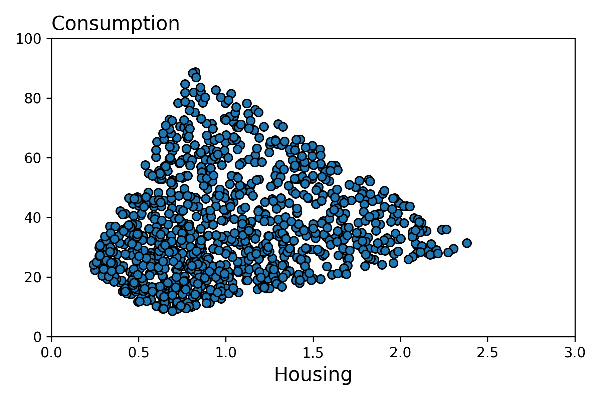
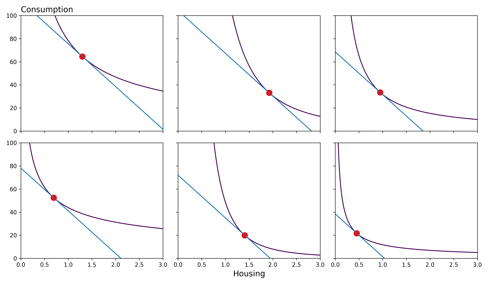

??? tip "Notebooks"
    |Description | Notebook | Status 
    |:---:|:---:|:---:|
    Solve Optimal Bundle |  | Work In Progress

!!! tldr "Overview"

    The aim of this lecture is to illustrate how we can model demand. 

### **Introduction** 
In your Principles of Microeconomics course, presumably the demand function was one of the first economic conepts that you were introduced to. In this lecture, we'll construct the demand function by modeling individual behavior. 

#### Why Do We Care?
We would like to make our models realistic enough to be able to capture more nuanced questions. For instance, we may be interested in understanding the effect of providing legal representation in civil cases on low-income individuals. Or, we may be interested in predicting how rising interest rates will affect the car market. In the first example, it's clear that we need models that distinguish between individuals (our question only pertains to a subset of the population). In the second example, our prediction will likely be better if we can model the effect on the various subgroups such as low and high income consumers.

#### What is the Important Aspect. 
Even though we're going to model 1000s of consumers, we're going to write down our model as if we had only one consumer. To be specific, we're going to write down the optimal choice problem for a "Parameterized" consumer. 

#### How Does This Fit? 
We've already introduced all of the necessary components for the consumer problem (Choice Set, Constraint Function, Utility Function, Solver). We'll now bring those components together to solve for the optimal choice. 

### **Consumer Problem**

Let's consider the following simplified problem where a consumer selects some amount of consumption and housing to maximize their utility subject to a budget constraint. **Note** $\alpha$ parameterizes the utility function and $m$ and $p$ parameterize the constraint function. 

$$\underset{h,c}{\text{maximize}} \ U_{\alpha}(h,c) \quad s.t \ ph + c \leq m $$

Hopefully it is clear by now that if we give this problem to a solver, we'll get back the optimal bundle. The optimal bundle corresponds to an element in the feasibility set with the highlest level of utility.

<figure markdown>
  { width="500" }
  <figcaption>Optimal Choice</figcaption>
</figure>

To capture consumer heterogeneity in this context, we allow the parameters of the utility and constraint functions to vary across individuals. Doing so, each consumer essentially faces their own optimal choice problem. Below, we show a scatter plot of the optimal amount of consumption and housing for $1000$ consumers. To construct this graph, we simply solved the 1000 optimal choice problems "in parallel". That is that is thanks to the advances in AI related computing, it is trivial to call 1000 solvers at the same time!

<figure markdown>
  { width="500" }
  <figcaption>Vectorized Optimal Choice</figcaption>
</figure>

For a subset of these consumers, we plot their budget constraints and optimal bundles.

<figure markdown>
  { width="700" }
  <figcaption>6 Optimal Choices</figcaption>
</figure>

### **The Demand Function**
As explained in in notes on [functions](./../math/functions.md), the relationship between the parameters of an optimization problem and the solution to the problem is an implicit function. In the above example, this implicit function is the **demand** function for an individual consumer $i$. We use the $i$ subscript to denote that these parameter can differ across individuals.

$$h^*(\alpha_i, m_i, p), c^*(\alpha_i, m_i, p)$$

We can then form the market demand by summing the individual demand functions: 

$$h(p) = \sum _i h^*(\alpha_i, m_i, p), \quad  c(p) = \sum _i c^*(\alpha_i, m_i, p)$$

#### Elasticity of Demand 

A concern is that given this level of detail in our models, it becomes hard to capture "statistics" of interest such as the elasticity of demand (percentage change in quantity demanded over the percentage change in price). And indeed, the below derivation may be quite daunting/laborious if we solved for it by hand. (**Note** differentiation is a linear operator which is why we can move it inside the sum).

$$\begin{align*} \varepsilon _h(p) &= \frac{p}{h(p)}\frac{d}{dp}h(p) \\ 
&= \frac{p}{h(p)}\frac{d}{dp} \Big(\sum _i h^*(\alpha_i, m_i, p)\Big) \\ 
&= \frac{p}{h(p)} \Big(\sum _i \frac{d}{dp}h^*(\alpha_i, m_i, p)\Big)  \end{align*}$$

Writing our models via the computer though makes the computation straight forward. We only have to write down the top line and the computer does the rest!