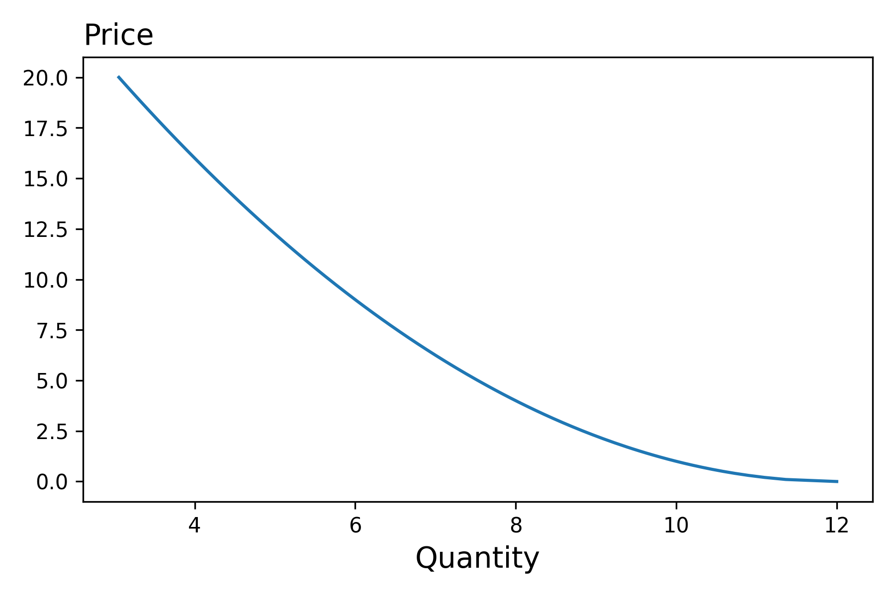
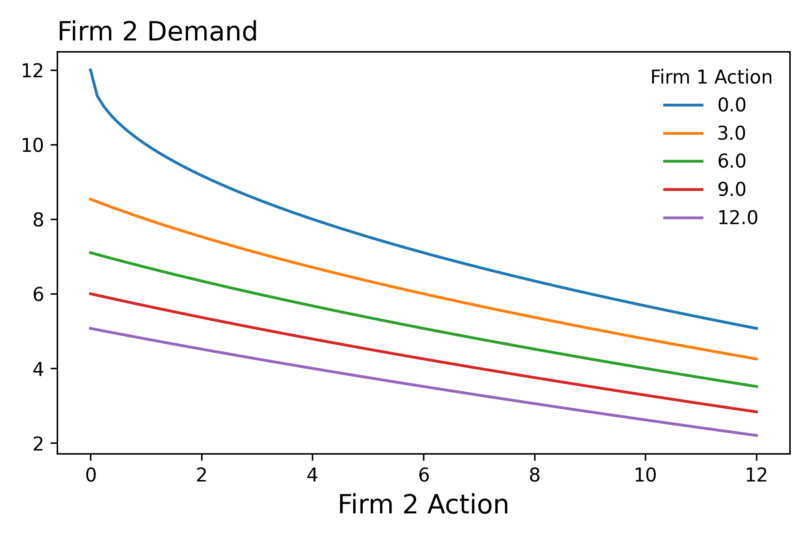
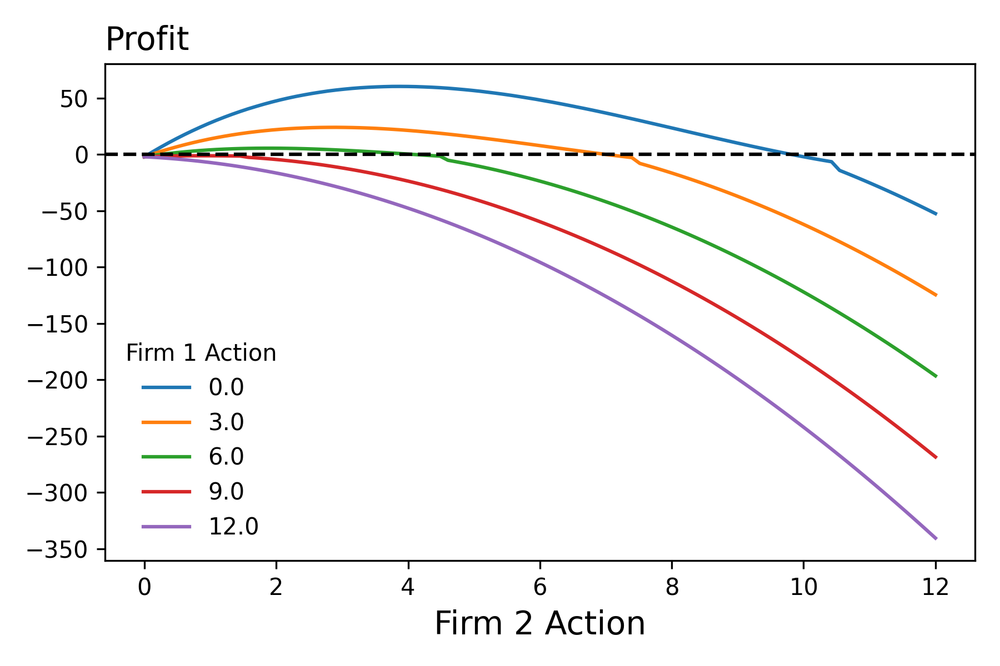
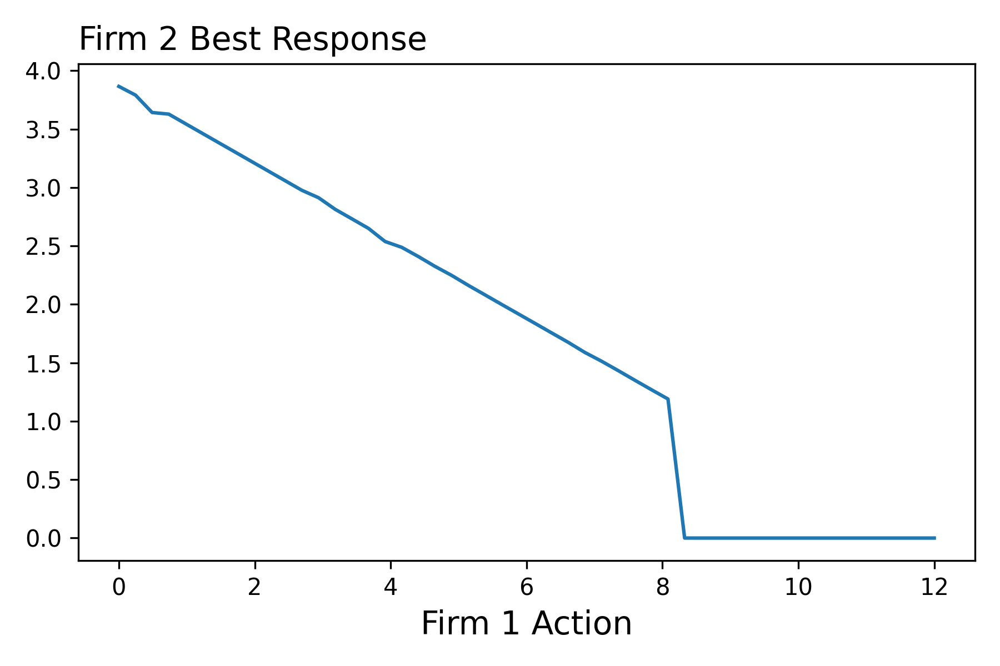
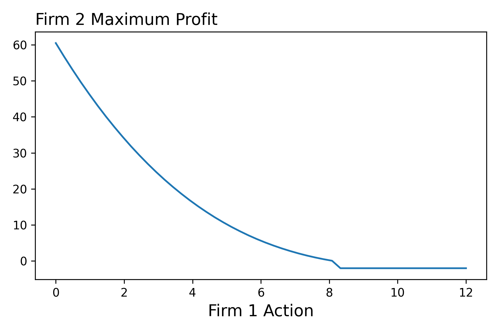

??? tip "Notebooks"
    |Description | Notebook | Status 
    |:---:|:---:|:---:|
    Stackelberg Model |  | Work In Progress

!!! tldr "Overview"

    The aim of this lecture is to introduce the fundamentals of game theory

### **Introduction**
Up to this point in the class we have considered models with following form.[^1] We've seen this in the context of individual consumers maximizing their utility subject to a budget constraint, firms maximizing profits given their production function, and a government entity maximizing tax revenue. What these models shared in flavor was the fact that one agent was maximizing taking the other agent's decisions as given. For example, in the optimal tax case, the government set the tax assuming that individuals selected the optimal bundle in response to the tax. 

In this lecture we're going to show how the type of modeling that we're now accustomed too, can be extended to model multiple agents acting at the same time, where their may be uncertainty over how the other agent will behave. To keep things clear, we begin by discussing the following two player game. Note, in the language that we've already developed in this class, the agents can differ in terms of their choice sets, constraint functions, and objective functions. Further note how the objective functions of the agents take as an argument the action of the other agent. 

$$\underset{x_1 \in S_1}{\text{Maximize}} \ f_1(x_1, x_2) \quad \underset{x_2 \in S_2}{\text{Maximize}} \ f_2(x_1, x_2)$$

We will consider settings where agents actions will occur in a sequence. That is, Coke acts first and then Pepsi responds. We'll also consider games though where both firms act at the same time. For example, both Nike and Addidas decide how many shoes to produce for the holiday season. 

#### **Notation/Language**

- In game theory, an element of the choice set is referred to as a strategy. 

### **Stackelberg Model**
Let's consider the following market where two firms decide how much to produce, acting one after the other. That is one firm acts first by deciding how much output to produce. The second firm, seeing the action of the first firm then decides how me to produce. We will assume that both firms know the market demand curve, know the costs functions of each other, produce identical products and maximize their current period profit. Under these assumptions, we can predict the output decisions of each firm as follows:

<figure markdown>
  { width="500" }
  <figcaption></figcaption>
</figure>

We first start by considering the optimization problem of the second firm. By the time it decides how much output to produce, the firm firm will have already made this decision. Therefore, the second firm's inverse demand function is the following: 

<figure markdown>
  { width="500" }
  <figcaption>$$D^{-1}(x_1 + x_2)$$</figcaption>
</figure>

Which means that the second firm's optimization problem is as follows: [^2]

<figure markdown>
  { width="500" }
  <figcaption></figcaption>
</figure>

$$\begin{align*}\underset{x_2 \in S_2}{\text{Maximize}} \ \text{Profit}(x_1, x_2) &= \text{Revenue}(x_1, x_2) - \text{Cost}(x_2) \\ 
&= \text{Price}(x_1, x_2)x_2 -  \text{Cost}(x_2) \\ 
&= D^{-1}(x_1 + x_2)x_2 -  \text{Cost}(x_2) \\\end{align*}$$

Pause for a moment and consider the above set up. What do you see lurking in the shadows of the problem? Your fingers snap together creating a popping sound as your see it -->  an implicit function that maps the decisions of the first firm to the optimal choice of the second firm! We'll you are ahead of the notes, so that shows your understanding! So nice work!  

<figure markdown>
  { width="500" }
  <figcaption>$$x_2^*(x_1)$$</figcaption>
</figure>

??? tip "Solving the Problem"

    If we want to solve this problem by hand we could proceed in three steps. First we would compute the partial derivative of the profit function with respect to the second firm's choice variable. Then we would want to find the root of this function. That is, we would want to determine where the partial derivative is equal to zero. Second, we would want to evaluate the profit function at zero, the thinking being that given the output produced by the first firm, it might be in the second firm's best interest to produce nothing. Finally, as illustrated below, we would want to select either the quantity we found in step one or 0 depending on which one lead to a greater profit.

    $$\text{maximum}(\text{Profit}(x_1, 0), \text{Profit}(x_1, \underset{x_2}{\textrm{solve}} \ \partial _{x_2}\text{Profit}(x_1, x_2) = 0 )$$

In this context, we refer to this function as firm two's best response function. With this function, we can then evalute the firm two's maximum profit as a function of firm one's action 

<figure markdown>
  { width="500" }
  <figcaption></figcaption>
</figure>

$$\begin{align*} \tilde{\text{Profit}}(x_1):= \text{Profit}(x_1, x_2^*(x_1)) \end{align*}$$

<!-- #### Visualizing the Second Firm Problem. 

- A Nash Equilibrium is a set of stategies, one for each player/agent, such that taking the stategies of the other players as given, each agent has no incentive to change their strategy.

### **Limitations of Nash Equilibrium**
- There can be multiple equilibriums 
- Games might not have any equilibriums 
- What is the justification for why we would expect firms to play strategies that coincide with an equilibrium? -->

[^1]: I'm equating model here with optimization problem 

[^2]: Note, we assme that the actions of one firm does not affect the cost function of the other firm!

