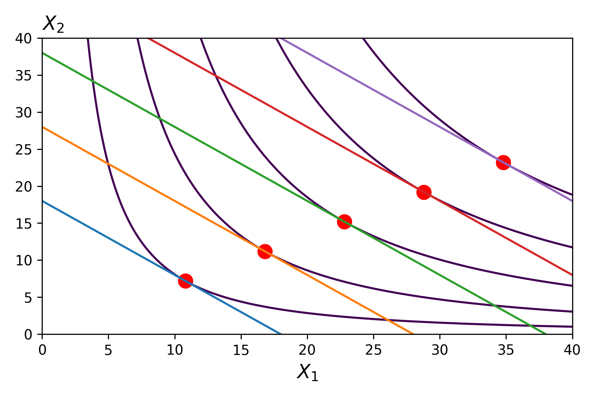
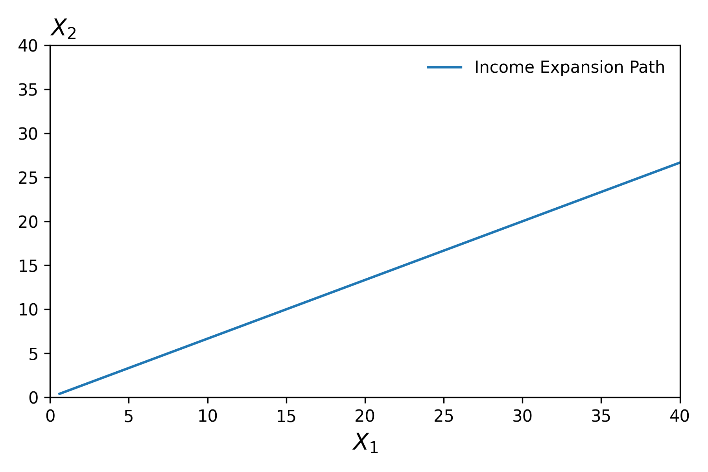
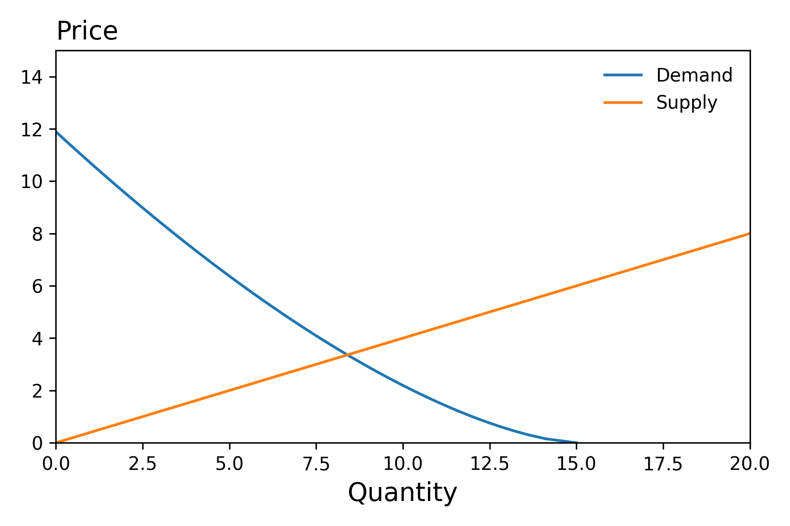
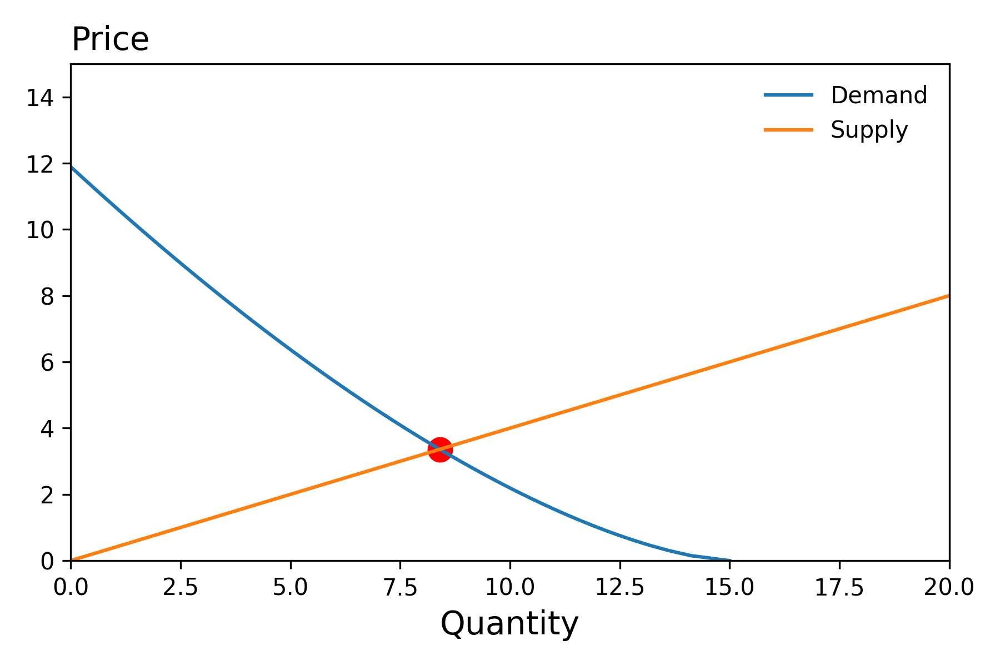

??? tip "Notebooks"
    |Description | Notebook | Status 
    |:---:|:---:|:---:|
    Income Expansion Path |  | Work In Progress

### **Introduction**

### **Individual Level**
Once we have a model, such as consumer demand, it's natural to use the model to think about how certain factors affect demand. This exercise is referred to as comparative statics. We change a parameter, such as income, and we want to understand how demand changes. 

Below we highlight how the optimal choice problem changes as we increase income. 

<figure markdown>
  { width="500" }
  <figcaption>Income Expansion Path</figcaption>
</figure>

This relationship is an implicit function whose graph we depict below.

<figure markdown>
  { width="500" }
  <figcaption>Engle Curve</figcaption>
</figure>

### **Market Level**
Given supply and demand functions (S, D), whose graphs we depict below,

<figure markdown>
  { width="500" }
  <figcaption>Market</figcaption>
</figure>

#### Solving For Equilibrium

 we can solve for the equilibrium price and quantity by solving the following system of equations (4 equations and 4 unknowns). Note, we distinguish between the price that consumers pay, $p_d$, and the price that suppliers receive, $p_s$.

$$\begin{align*}
q_d &= D(p_d) \\ 
q_s &= S(p_s) \\
q_d &= q_s \\
p_d &= p_s \\ 
\end{align*}$$

<figure markdown>
  { width="500" }
  <figcaption>Market</figcaption>
</figure>

We can solve the above system of equations by (1) constructing a vector valued function $F$ and then (2) using a solver to find the root of this function: 

$$\begin{align*} 
F(q_d, q_s, p_d, p_s) = \begin{bmatrix} q_d - D(p_d) \\ 
                                        q_s - S(p_s) \\
                                        q_d - q_s \\
                                        p_d - p_s \\ 
\end{bmatrix}\end{align*}$$

#### Incorporating Taxes

With this set-up, we can then solve for the new equilibrium under a quantity tax ($p_d = p_s + \text{tax})$, value tax $p_d = (1 + \text{tax})p_s$, by re-writing the final equation with the new relationship in place. Indeed it is then possible the explore how the equilibrium quantity varies with the tax, $q^*(\text{tax})$, by calling solver on multiple versions of the problem in parallel. 

<figure markdown>
  { width="500" }
  <figcaption>Vectorized Market</figcaption>
</figure>

#### Who Pays the Tax?
See the problem set.

#### Deadweight Loss 
As the above figure highlights, as we increase the tax, the equilibrium quantity falls which gives rise to a deadweight loss (forgone gains from exchange. We can determine how the deadweight loss varies as a function of the tax via the following function)

$$\text{Deadweight Loss} :: \text{Demand Functions} \to \text{Supply Functions} \to \text{Taxes} \to \mathbb{R}$$

$$\int _{q^*(t)} ^{q^*(0)} \text{Demand}^{-1}(q) - \text{Supply}^{-1}(q) dq$$

