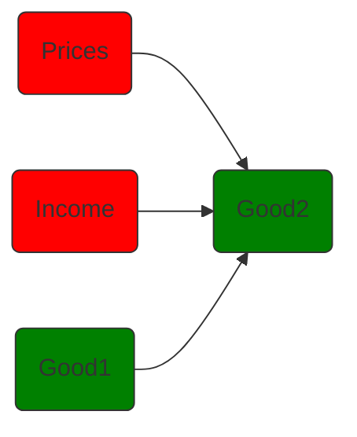
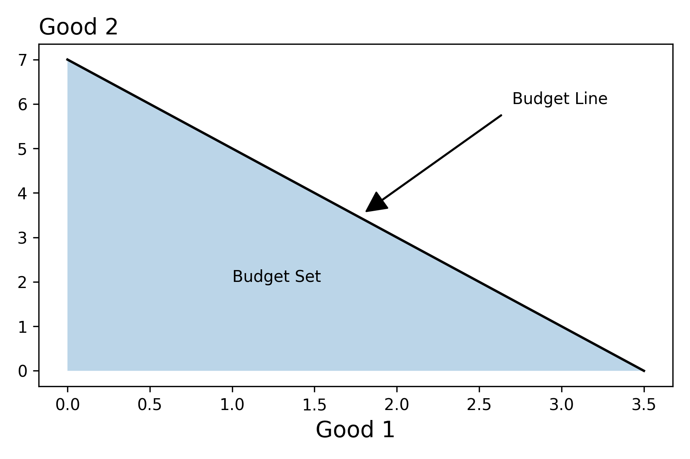
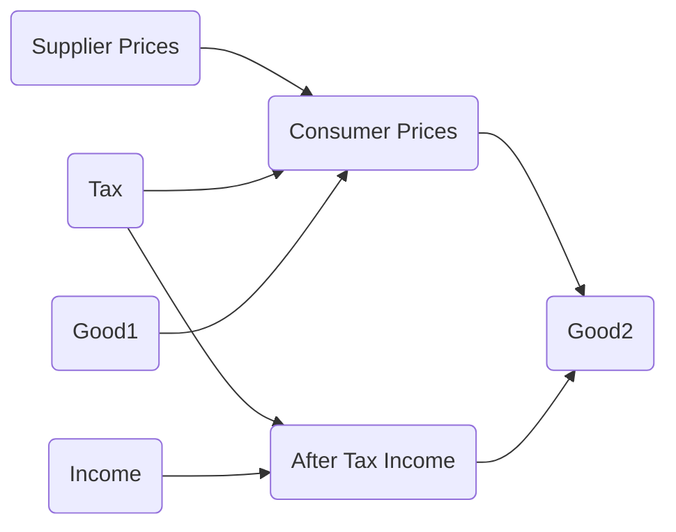
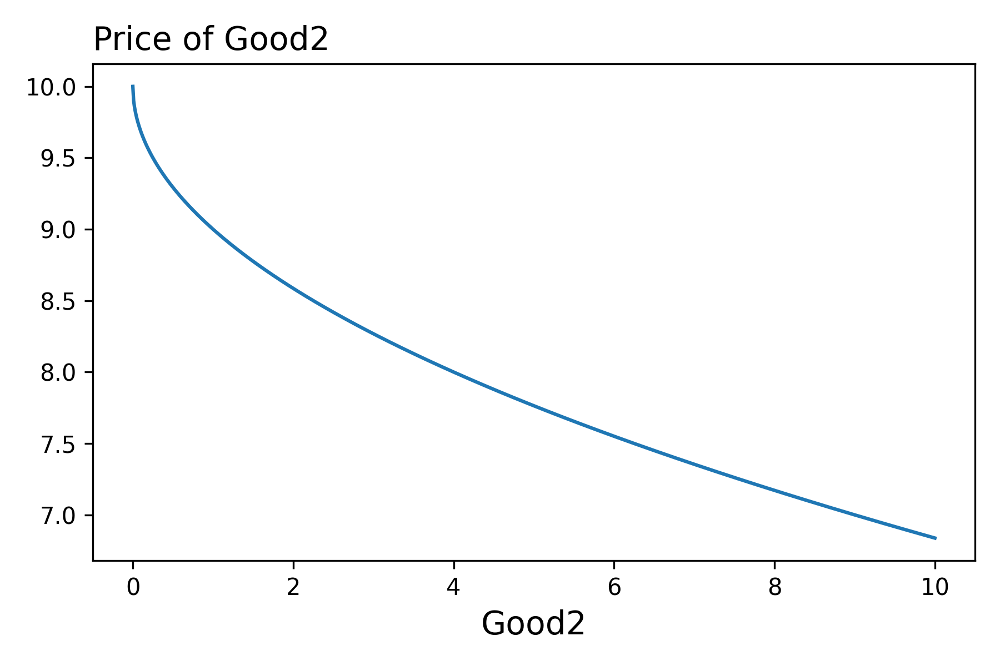

??? tip "Notebooks"
    |Description | Notebook | Status 
    |:---:|:---:|:---:|
    Budget Constraints | <a href="https://colab.research.google.com/github/pharringtonp19/mecon/blob/main/notebooks/budget_constraint.ipynb" target="_parent"></a> | Work In Progress
    Budget Constraints With Taxes | <a href="https://colab.research.google.com/github/pharringtonp19/mecon/blob/main/notebooks/budget_constraint_with_taxes.ipynb" target="_parent"></a> | Work In Progress

$$B := \{x \in \mathcal{X} | \ F(x) \leq 0\}$$

To begin, let's consider the situation where a consumer with a certian level of income $m$ chooses a bundle from among $n$ goods. 
Mathematically we represent this situation as follows:

- **Choice Variables**:
    - Let $x \in \mathbb{R}^n$ represent a bundle of goods. That is $x.i$ denotes the amount of the $i^{th}$ good in the bundle 
- **Parameters**:
    - Let $p \in \mathbb{R}^n$ represent the prices of the $n$ goods. That is, $p.i$ corresponds to the price of the $i^{th}$ good. 
    - Let $m \in \mathbb{R}$ represent the amount of income. 

Then we can define our budget set as follows: 

$$\begin{align*}B := \{x \in \mathcal{X} | \ F_{p,m}(x) \leq 0\} \\\\
\text{where} \quad F_{p,m}(x) = p \cdot x - m \end{align*}$$

To "derive" the budget set, we have to define the relationship between good1 and good2 such that the expenditure of the bundle is equal to the income. To highlight this process, we consider a set-up where $n=2$. Our task is then, setting $F_{p,m} = 0$, to "solve" for $x_2$ interms of $x_1$.

$$\begin{align*}0 &= p_1x_1 + p_2x_2 - m \\ 
p_2x_2 &= m - p_1x_1 \\ 
x_2 &= \frac{m}{p_2} - \frac{p_1}{p_2}x_1\end{align*}$$

??? tip "Math on the Computer"

    ```python 
    import jax
    import jax.numpy as jnp 
    import matplotlib.pyplot as plt
    from functools import partial 
    from typing import NamedTuple 

    class Params(NamedTuple):
    """Parameters of the budget constraint"""
    income: float 
    price1: float 
    price2: float 

    class ChoiceVariables(NamedTuple):
    """Bundle of Goods"""
    good1: float 
    good2: float 

    def F(params: Params, good1: float): 
    """Constraint Function"""
    good2 = params.income/params.price2 -good1*(params.price1/params.price2)
    return ChoiceVariables(good1, good2)

    params = Params(35.0, 10.0, 5.0)                                      # Initialize Parameters for F         
    good1s = jnp.linspace(0, params.income/params.price1, 100)            # Max x1 is m/p1
    bundles = jax.vmap(partial(F, params))(good1s)                        # Partially Evaluate + "Vectorize"
    ```


<figure markdown>
  { width="500" }
  <figcaption>Budget Constraint</figcaption>
</figure>

It can be helpful to get into the habit of asking, how do "things" change if we tweak the parameters? In this setting, we may be interested in understanding how the budget set changes in response to an increase in income, or to a decrease in the prices. See if you can work through this.

##### Taxes/ Subsidies/ Market Caps

- There is often a difference between the price that suppliers receive, $p_s$, and the prices that consumers pay, $p_c$. We can represent this difference via a function that maps $p_s$ to $p_c$. 

$$\begin{align*} p_s &\longmapsto p_s + \alpha \\ 
 p_s &\longmapsto (1+ \alpha)p_s \end{align*}$$

- We can also generalize the set-up by allowing the the tax/subsidy depend on the amount of the good. 


??? Danger inline end "Challenge"
    Here we introduce the concepts of (1) refactoring and (2) implicit function

    Don't :worried:, though, if you don't follow everything the first time. 
    We'll continue to use these terms throughout the semester until it's all 
    :slight_smile: 

The key challenge here is that the price of good2 might depend on how much of it one consumes. To keep things simple, let's understand this issue by adjusting the previous example only slightly. 

$$\begin{align*}0 &= p_1x_1 + p_2(x_2)x_2 - m \\ 
p_2(x_2)x_2 &= m - p_1x_1 \\ \end{align*}$$

As we see, we can't follow the steps we took above -- we can't divide both sides by $p_2$! As mentioned previously, though we want to able to work at different levels of abstraction. In this context, the pressing question is, given some amount of good1, can we solve for the good2 on the budget line as a function of $p_2(x_2)$? 

<figure markdown>
  { width="500" }
</figure>

That is, previously we working with a function with the following pseudo type signature 

$$\begin{align*}f :: \text{params} \to \text{good1} \to \text{price2} \to \text{good2}\end{align*}$$

and know we would like to work with a function with the following signature: 

$$\begin{align*}f :: \text{params} \to \text{good1} \to \big(\text{good2} \to \text{price2}  \big)  \to \text{good2} \end{align*}$$

- Partially evaluated you might consider this to be a high-order implicit function! 
- The last arrow represents an implicit function

!!! Question "Consider" 

    How could we extend the above model to factor in the market cap for electric vehicles?

