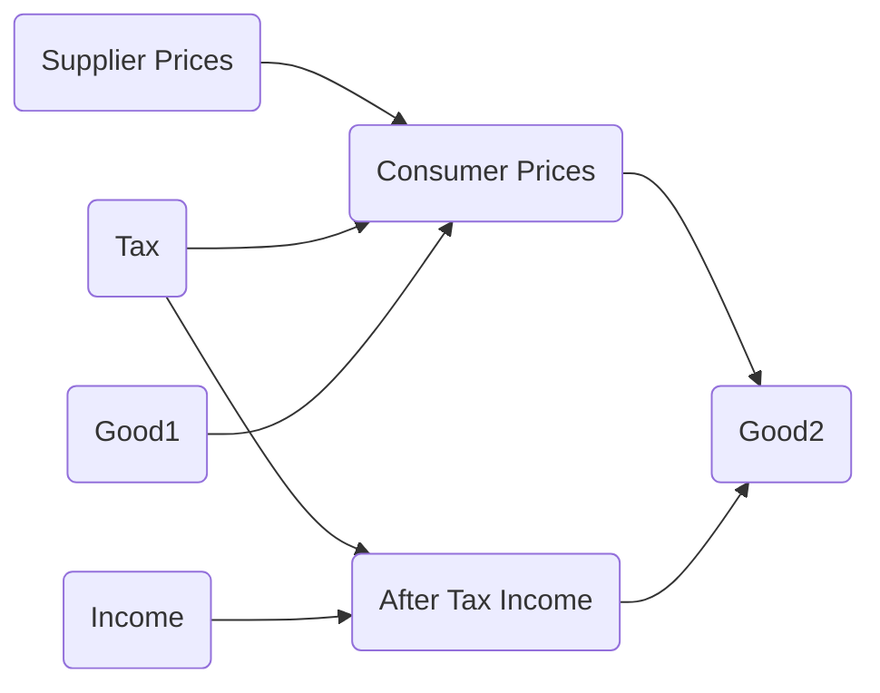

??? tip "Notebooks"
    |Description | Notebook | Status 
    |:---:|:---:|:---:|
    Budget Constraints |  | Work In Progress
    Budget Constraints With Taxes |  | Work In Progress

!!! tldr "Overview"

    The aim of this lecture is to illustrate how we can use the structure developed in the previous lecture to represent the constraints that consumers face.

### **Intuitive Understanding of the Problem**

Let's begin by thinking about the consumer's choice problem without worrying for the moment how we can we represent this mathematically. The consumer would like to purchase some amount of goods and services. During the course of the week, for instance, they probably want to good food shopping, maybe put some gas in their car, $\dots$, things of that nature. And they will be constrained by the amount of income they have.[^1]

### **Structure**

#### Choice Variables
The choice set will be the set of all possible "bundles" that a consumer could buy. Intuitively, a bundle is a collection of goods and services with specific amounts of each good and service. For example, if the choice set is $\{$Apples, Oranged $\}$, then a bundle could be represented as follows 

$$\begin{align*}
\{\text{Apples}: 3, \text{Oranges}:2 \}
\end{align*}$$

To make things simple mathematically, we will often represent a bundle as a vector where the index of the vector implicity represents the good or service. For instance, we can represent the above bundle via the following vector: 

$$\begin{align*}
[3, 2] \in \mathbb{R}^2
\end{align*}$$

More generally, $x \in \mathbb{R}^n$ represent a bundle of goods and services. And, $x.i$ denotes the amount of the $i^{th}$ good or service in the bundle.

#### Parameters

In this set-up, we are going to consider two types of parameters. Again, these can be thought of as aspects of the choice problem that the consumers does not have direct influence over.[^2]

The first, which we'll denote by $m$, will be income which we'll think of as the amount of money you can spend. The second type of parameters will be the price of each of the $n$ goods and services. Note the ordered structur that we imposed on the goods and services will carry over the the prices. That is, we can represent prices as a vector, $p \in \mathbb{R}^n$, where $p.i$ corresponds to the price of the $i^{th}$ good or service. 

#### Constraint Function 
With an understanding of the choice set and the parameters we can then define the **parameterized** constraint function as follows:

$$\begin{align*}F &:: \mathbb{R} \to \mathbb{R}^n \to \mathbb{R}^n \to \{0, 1\} \\\\
F(m, p, x) &= \Big(\sum _{i=1}^n p_i x_i \Big) > m \end{align*}$$

#### Feasible Set 
As we discussed in the previous lecture, a parameterized constraint function defines a parameterized feasibility set. 

$$\begin{align*}B &:: \mathbb{R} \to \mathbb{R}^n \to \mathcal{P}(\mathbb{R}^n) \\\\
B(m, p) &= F_{m,p}^{-1}(0) \\\\ 
B(m, p) &= \Big\{x \in \mathcal{X} | \Big(\sum _{i=1}^n p_ix_i \Big)  \leq m\Big\}\end{align*}$$

### **Example**
Let's consider the situation were there are two good $n$.[^3] Then for a given level of income and prices, our budget set will be defined as follows: 

$$\begin{align*}B(m,p)= \{x \in \mathbb{R}^2 \mid p_1x_1 + p_2x_2 \leq 0 \}\end{align*}$$

We can represent this visually as follows:

<figure markdown>
  { width="500" }
  <figcaption>Budget Constraint</figcaption>
</figure>

Where we've also represented the budget line which can be thought of as a the **graph** of function between $x_1$ and $x_2$

$$\begin{align*} \text{Budget Line} := \{ (x_1, x_2) \in \mathbb{R}^2 \mid x_2 = \frac{m}{p_2} - \frac{p_1}{p_2}x_1 \} \end{align*}$$

Which we can derive as follows:

$$\begin{align*}0 &= p_1x_1 + p_2x_2 - m \\ 
p_2x_2 &= m - p_1x_1 \\ 
x_2 &= \frac{m}{p_2} - \frac{p_1}{p_2}x_1\end{align*}$$

It can be helpful to get into the habit of asking, how do "things" change if we tweak the parameters? In this setting, we may be interested in understanding how the budget set changes in response to an increase in income, or to a decrease in the prices. See if you can work through this.

<!--

##### Taxes/ Subsidies/ Market Caps

- There is often a difference between the price that suppliers receive, $p_s$, and the prices that consumers pay, $p_c$. We can represent this difference via a function that maps $p_s$ to $p_c$. 

$$\begin{align*} p_s &\longmapsto p_s + \alpha \\ 
 p_s &\longmapsto (1+ \alpha)p_s \end{align*}$$

- We can also generalize the set-up by allowing the the tax/subsidy depend on the amount of the good. 

??? Danger inline end "Challenge"
    Here we introduce the concepts of (1) refactoring and (2) implicit function

    Don't :worried:, though, if you don't follow everything the first time. 
    We'll continue to use these terms throughout the semester until it's all 
    :slight_smile: 

The key challenge here is that the price of good2 might depend on how much of it one consumes. To keep things simple, let's understand this issue by adjusting the previous example only slightly. 

$$\begin{align*}0 &= p_1x_1 + p_2(x_2)x_2 - m \\ 
p_2(x_2)x_2 &= m - p_1x_1 \\ \end{align*}$$

As we see, we can't follow the steps we took above -- we can't divide both sides by $p_2$! As mentioned previously, though we want to able to work at different levels of abstraction. In this context, the pressing question is, given some amount of good1, can we solve for the good2 on the budget line as a function of $p_2(x_2)$? 

<figure markdown>
  { width="500" }
</figure>

That is, previously we working with a function with the following pseudo type signature 

$$\begin{align*}f :: \text{params} \to \text{good1} \to \text{price2} \to \text{good2}\end{align*}$$

and know we would like to work with a function with the following signature: 

$$\begin{align*}f :: \text{params} \to \text{good1} \to \big(\text{good2} \to \text{price2}  \big)  \to \text{good2} \end{align*}$$

- Partially evaluated you might consider this to be a high-order implicit function! 
- The last arrow represents an implicit function

!!! Question "Consider" 

    How could we extend the above model to factor in the market cap for electric vehicles?

-->

[^1]: They will also be limited or constrained by the time they have to run all these errands, but we omit this key feature for the moment from our model.

[^2]: Hopefully, though you will be able to think about how we can extend this setup so that income is something that consumers are choosing!

[^3]: The reason we start with two goods is because we can represent two goods visually.