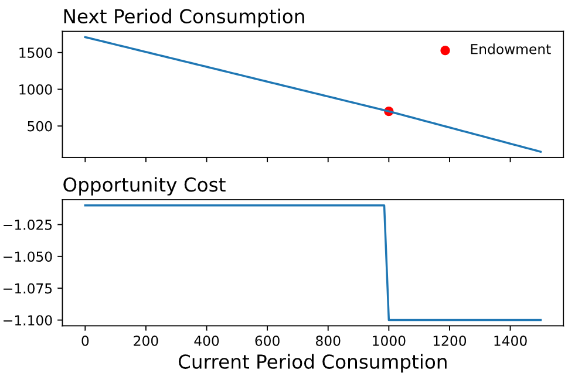

??? tip "Notebooks"
    |Description | Notebook | Status 
    |:---:|:---:|:---:|
    Budget Constraints |  | Work In Progress

!!! tldr "Overview"

    In this lecture, we apply the structure we've developed about constraints to a variety of real world/economic problems. 

### **Motivation**
The risk of emphasizing the structure of the constraint setup and using toy examples with bundles consisting of apples and oranges is that the broader usefulness of this framework might initially be obscured. In this lecture, we address this potential shortcoming by working through the following examples. -- randomized control trials, intertemporal choice, student achievement. 

### **Randomized Control Trials**
As you will see later in your Economic courses, if you haven't already, randomized control trials are considered the gold standard for assessing the effectiveness of a treatment.[^1] As a bit of background, a randomized control trial can be thought of as an experiment where one group receives the treatement and another group does not. You then compare the average outcomes across the two groups to understand the effects of the treatment. 

$$\begin{align*} \hat{\mu} = \hat{\mu}_{\text{treated}} - \hat{\mu}_{\text{control}} \end{align*}$$

In many situations, though, the "treatment" of interest cannot be assigned. For example, let's assume that you are interested in global health and want to understand the extent to which a water purifier improves child health outcomes. As a researcher/aid worker/global health member, you cannot randomly assign whether a child uses the water purifier. You don't have that type of influence. What you can do instead, though, is to randomly assign **access** to a water purifier. Perhaps you do this geographically by randomly assigning some villages access to the water purifier and others not. By randomly assigning access, you are then changing certain individuals' feasibility set.

### **Intertemporal Choice**
In our previous work on budget constraints we modeled a consumer as selecting a vector in $\mathbb{R}^n_+$ where each element of the vector corresponded to a good or service. This same setup, though, also works if we want to model how consumers might decide to spread income (smoothing!) across time. 

Let's consider an individual with $m$ dollars today. The individual's decision is how much to spend on good and services today versus tomorrow. This is a two period model. We'll assume that whatever is not consumed today $m-x_1$ is saved at an interest rate of $r$. 

We can express the budget constraint as follows, where we allow $x_1$ and $x_2$ to denote consumption in periods $1$ and $2$.

$$\begin{align*} x_2 &= (m - x_1)(1+r) \\ 
&= (1+r)m - (1+r)x_1\end{align*}$$

#### Extensions
We can enhance this model in a variety of ways. For instance, perhaps we want to capture the fact that individual will have some additional income in period two -- Note how this doesn't affect the opportunity cost. 

$$\begin{align*} x_2 = m_2 + (m_1 - x_1)(1+r) \end{align*}$$

Or that the interest rate on savings is below that on borrowing -- now the opportunity cost is affected!

$$\begin{align*} x_2 = \begin{cases}
  m_2 + (m_1 - c)(1 + r_s)  &  \text{if} \ m_1 - c \geq 0  \\
  m_2 + (m_1 - c)(1 + r_b)  &  \text{if} \ m_1 - c < 0  \\
\end{cases} \end{align*}$$

<figure markdown>
  { width="500" }
  <figcaption>Intertemporal Choice</figcaption>
</figure>

#### Present Discounted Value 
In the context of the bugdet constraint where bundles consist of two goods, it is relatively straightforward to consider what the maximum amount that you can consume of each good. For example, let's assume that we have an income of $\$10$ and the price of oranges and apples are $\$5, \$2$ respectively. Then we compute the maximum value of each good as follows

$$ \begin{align*} \text{max oranges} &:= \frac{m}{p_{\text{oranges}}} = \frac{10}{5} = 2 \\ 
\text{max apples} &:= \frac{m}{p_{\text{apples}}} = \frac{10}{2} = 5 \\\end{align*}$$

In the context of savings, the same thought exercise applies although it may not be as intuitive at first. Given an endowment $(m_1, m_2)$ and interstest rates, $r_{\text{saving}}, r_{\text{borrowing}}$, we can consider both the maximum amount of consumption today and the maximum amount of consumption tomorrow. 

The maximum consumption today would be the case where we spend all the money we have today $m_1$ and borrow against the money we'll get tomorrow. The idea being that there exists a financial entity that is willing to give us some amount of money today $v_1$ in exchange for the income we'll receive tomorrow, $m_2$. We can compute this by making use of the borrowing rate as follows:

$$ \begin{align*} v_1(1+r_{\text{borrowing}}) &= m_2 \\
 v_1 &= \frac{m_2}{(1+r_{\text{borrowing}})} \\ \end{align*}$$

Putting this information together, we see that the present value of our endowment is 

$$ \begin{align*} m_1 +  v_1 = m_1 \frac{m_2}{(1+r_{\text{borrowing}})}  \end{align*}$$

We can compute the "future" value of our endowment via a similair line of reasoning. The central issue is how do we value $m_1$ in terms of dollars in the next period[^2]. Hopefully we see by now that the value of $m_1$ in terms of period two dollars is $m_1(1+r_{\text{saving}})$ and therefore the value of our endowment in terms of next period dollars is 

$$ \begin{align*}  m_2 + m_1 (1+r_{\text{savings}})\end{align*}$$

??? question "Question 1" 

    Assume you have an endownment of $(100, 100)$. Assuming $r_{\text{borrowing}}$ and $r_{\text{saving}}$ are positive, illustrate why the present value must be greater than $100$ and less than $200$.

??? question "Question 2" 

    Why does changing the borrowing rate not affect the next period value of the endownment? 

??? question "Question 3" 

    Using the table below, tackle the following questions.
    A) Plot the budget constraint. B) Solve for the present value of the endowment point. C) Extend the model to allow the borrowing rate to depend on the endowment

    

    | Variable      | Value |  
    | :---        |    ----:   |  
    | $m_1$      | $1000$       |  
    | $m_2$   | $700$        |  
    | $r_{\text{savings}}$    | $0.01$        |  
    | $r_{\text{borrowing}}$   | $0.1$        |  

    

### **Student Achievement** 

Let's now assume that you work for a school district and are trying to make up for the loss of learning from Covid. Specifically, you are considering paying students for the number of books that they read. What is the choice set in this context? Let's build off of the above example and incorporate time. What is the key tradeoff in this context? 

<!-- ### **Bitcoin**
I want to carry off from the first example, where we went to a level of sophistication that allowed the interest rate to depend on the initial endowment. Now as a disclaimer, I don't have any background in finance, but I think it's worthwhile to consider this problem or decision of savings in the context of various financial "products" like bitcoin. The key idea here is that the value of the alternative is now unknown.  -->

[^1]: By treatment, we don't limit ourselves to a health or medical treatment. We use the term more generally to mean an intervention or policy initiative.

[^2]: Note that we are not considering inflation at the moment!

 