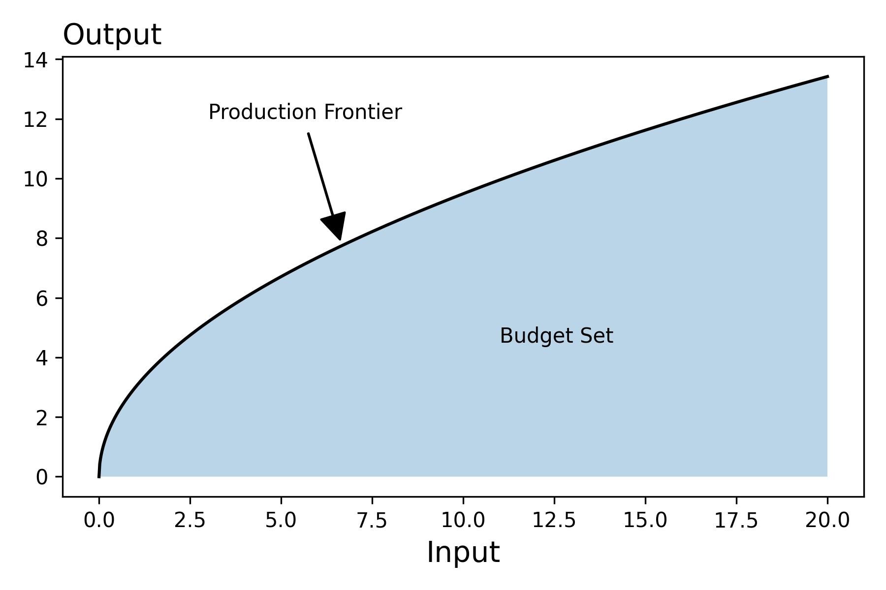

- In contrast to the budget set, apriori there is not maximum input level 
- The production set represents a conversion of inputs to outputs. In that sense, the production set captures the tradeoffs, whereas the budget line reflected the tradeoffs. 
- We want to allow the production function to be a vector valued function to capture that during the production process there can be some form of "waste" generated.

??? tip "Math on the Computer"

    ```python 
    import jax
    import jax.numpy as jnp 
    from functools import partial 
    from typing import NamedTuple 

    class Params(NamedTuple):
    """Parameters related to the
    production fn"""
    productivity: float 

    class ChoiceVariables(NamedTuple):
    """Input levels"""
    input1: float 

    class Outputs(NamedTuple):
    """Outputs of the production process"""
    output1: float

    def F(params: Params, input1: float): 
    """Production Function"""
    output1 = params.productivity * jnp.sqrt(input1)
    return Outputs(output1)

    n = 1000
    params = Params(3.0)                                               
    input1s = jnp.linspace(0, 20, n)             
    outputs = jax.vmap(partial(F, params))(input1s)     
    ```

<figure markdown>
  { width="500" }
</figure>

## Technical Rate of Substition


### Derivation

Let's say that we have an isoquant where $x$ and $y$ correspond to the amount of inputs used to produce $\alpha$ units of output

$$F(x, y) = \alpha $$

The above equation defines an implicit function which we can call explicitly as follows

$$x \longmapsto \underset{y}{\text{solve}}\ F(x,y) = 0$$

The technical rate of substitution is defined the derivative of the isoquant which we can compute as follows:

Let's start by writing the isoquant in terms of the function $y(x)$

$$F(x,y(x)) = 0$$

Now, both the left and right hand sides are functions of $x$, so we can differentiate both side
with respect to $x$.

$$\partial _xF(x,y(x)) = 0$$

From our understanding of calculus, this derivative can be expressed as follows:

$$\partial _0F(x,y) + \partial _1F(x,y(x))\frac{d}{dx}y(x) = 0 $$

Hopefully, you can interpret these terms: 

- **Marginal Product of $x$**: $\partial _0F(x,y)$
- **Marginal Product of $y$**: $\partial _1F(x,y)$
- **Technical Rate of Substitution**: $\frac{d}{dx}y(x)$

We see then that we can express the technical rate of substition in terms of the negative of the ratio of the 
two marginal products: 

$$\frac{d}{dx}y(x) = -\frac{\partial _0F(x,y)}{ \partial _1F(x,y(x))}$$

### Toy Example

To make things concrete, let's create a toy example. We'll consider the following production function

$$F(x, y) = Ax^{\alpha}y^{\beta}$$

Check your understanding -- With the following values, what do you get as the output and the technical rate of substitution? 

$$A=3, \alpha=0.8, \beta=1.3, x=10, y=2$$

??? tip "Math on the Computer"

    ```python 
    def F(x, y, A=3, alpha=0.8, beta=1.3):
        return A*x**alpha*y**beta 

    def implicit_grad(F, x, y):
        marginal_product_x, marginal_product_y = jax.grad(F, argnums=(0,1))(x, y)
        return -marginal_product_x/marginal_product_y

    print(f"Output: {F(10., 2.):.2f}, TRS: {implicit_grad(F, 10., 2.):.2f}")
    ```

In our work above, we compute the technical rate of substituion given the quantities of each input. This is not the only starting point (information) from which we can compute the TRS though. We can also compute it if we are given one input and the desired output. **Consider**: How might we incorporate our previous work to build this new function? 

The task is then to use the level of input of one good and the desired output to compute the input level of the other good. 

$$F, x, \text{level} \longmapsto F, x,  y(F, x, \text{level}) \longmapsto\underbrace{ \text{TRS}(F, x, y)}_{\text{We have this!}} $$

So we just need to be able to evaluate the implicit function which we can do by calling a solver

$$y(F, x, \text{level})$$

??? tip "Math on the Computer"

    ```python 
    def implicit_function(x, F, level):
        solver = jaxopt.GradientDescent(fun=lambda y: (F(x,y)-level)**2, maxiter=500)
        return solver.run(1.).params 

    def implicit_grad2(F, x, level):
        y = implicit_function(x, F, level)  
        return implicit_grad(F, x, y)

    print(implicit_grad(F, 2., 10.), implicit_grad2(F, 2., F(2., 10.)))
    ```