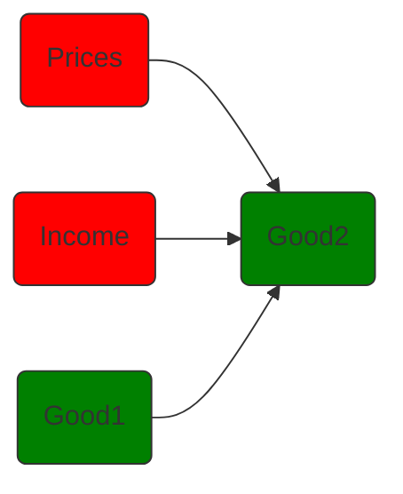
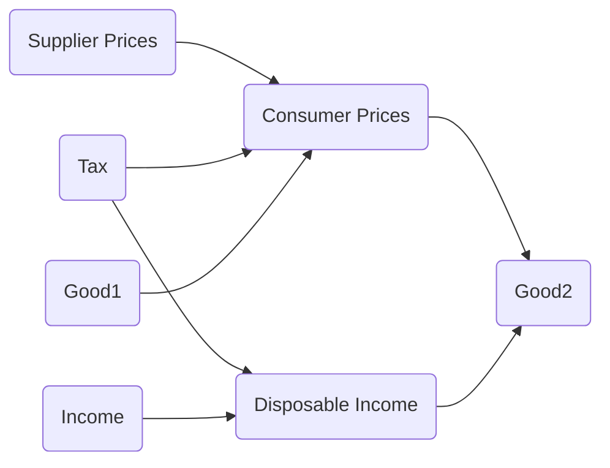

!!! tldr "Overview"

    The aim of this chapter is to illustrate how constraints reflect the "true" cost of some activity or some good. 

$$B := \{x \in \mathcal{X} | \ F(x) \leq 0\}$$

### **Consumers**

##### Budget Constraint
To begin, let's consider the situation where a consumer with a certian level of income $m$ chooses a bundle from among $n$ goods. 
Mathematically we represent this situation as follows:

- **Choice Variables**:
    - Let $x \in \mathbb{R}^n$ represent a bundle of goods. That is $x.i$ denotes the amount of the $i^{th}$ good in the bundle 
- **Parameters**:
    - Let $p \in \mathbb{R}^n$ represent the prices of the $n$ goods. That is, $p.i$ corresponds to the price of the $i^{th}$ good. 
    - Let $m \in \mathbb{R}$ represent the amount of income. 

Then we can define our budget set as follows: 

$$\begin{align*}B := \{x \in \mathcal{X} | \ F_{p,m}(x) \leq 0\} \\\\
\text{where} \quad F_{p,m}(x) = p \cdot x - m \end{align*}$$

It can be helpful to get into the habit of asking, how do "things" change if we tweak the parameters? In this setting, we may be interested in understanding how the budget set changes in response to an increase in income, or to a decrease in the prices. See if you can work through this.

??? tip "Math on the Computer"

    ```python 
    import jax
    import jax.numpy as jnp 
    import matplotlib.pyplot as plt
    from functools import partial 
    from typing import NamedTuple 

    class Params(NamedTuple):
    """Parameters of the budget constraint"""
    income: float 
    price1: float 
    price2: float 

    class ChoiceVariables(NamedTuple):
    """Bundle of Goods"""
    good1: float 
    good2: float 

    def F(params: Params, good1: float): 
    """Constraint Function"""
    good2 = params.income/params.price2 -good1*(params.price1/params.price2)
    return ChoiceVariables(good1, good2)

    params = Params(35.0, 10.0, 5.0)                                      # Initialize Parameters for F         
    good1s = jnp.linspace(0, params.income/params.price1, 100)            # Max x1 is m/p1
    bundles = jax.vmap(partial(F, params))(good1s)                        # Partially Evaluate + "Vectorize"
    ```


<figure markdown>
  { width="500" }
  <figcaption>Budget Constraint</figcaption>
</figure>

##### Taxes/ Subsidies

- There is often a difference between the price that suppliers receive, $p_s$, and the prices that consumers pay, $p_c$. We can represent this difference via a function that maps $p_s$ to $p_c$. 

$$\begin{align*} p_s &\longmapsto p_s + \alpha \\ 
 p_s &\longmapsto (1+ \alpha)p_s \end{align*}$$

- We can also generalize the set-up by allowing the the tax/subsidy depend on the amount of the good. 




### **Producers**

