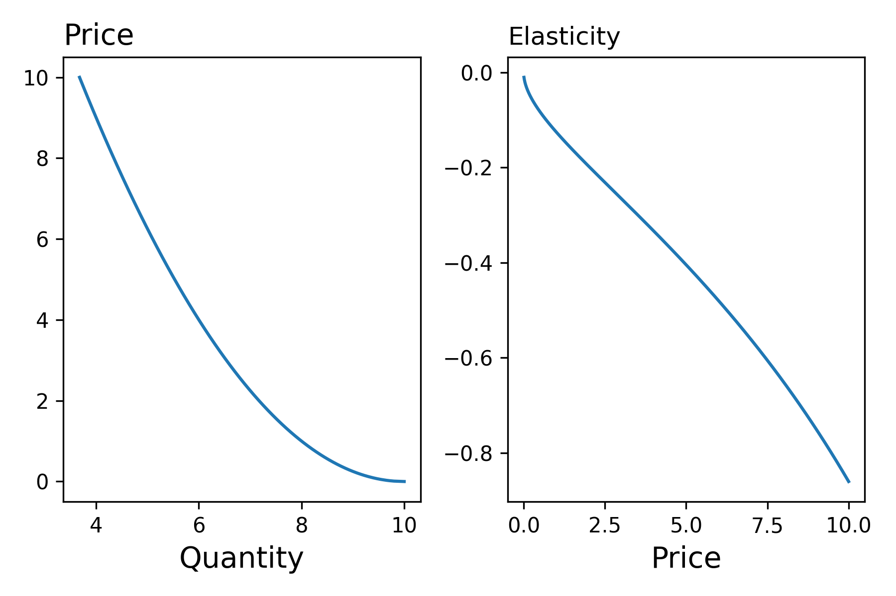
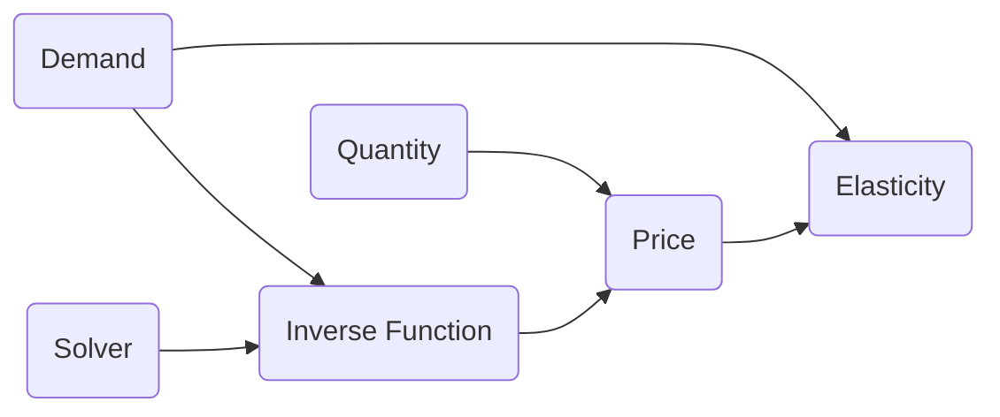

<a href="https://colab.research.google.com/github/pharringtonp19/mecon/blob/main/notebooks/elasticities.ipynb" target="_parent"></a>

An elasticity is a measure of responsiveness. The typical setting in Economics where this comes up is when we're interested in how sensitive demand is to a change in something. That something could be 

- Change in price of the good 
- Change in price of a substitute/complement of the good 
- Change in income.  

### **Computing Elasticities**

To keep things simple, we'll begin by describing how to measure how sensitive demand is to a change in price

$$\varepsilon _D = \frac{p}{q}q'(p)$$

We can compute the elasticity by defining a high-order function that takes the following two arguments: 


??? tip "Math on the Computer"

    ```python 
    def demand(p : float) -> float:
    return 10.0 - 2.*jnp.sqrt(p) 

    def elasticity(f: callable, p: float):
        q = f(p)   
        return (p/q) * jax.grad(f)(p)
    ```

<figure markdown>
  { width="500" }
</figure>




