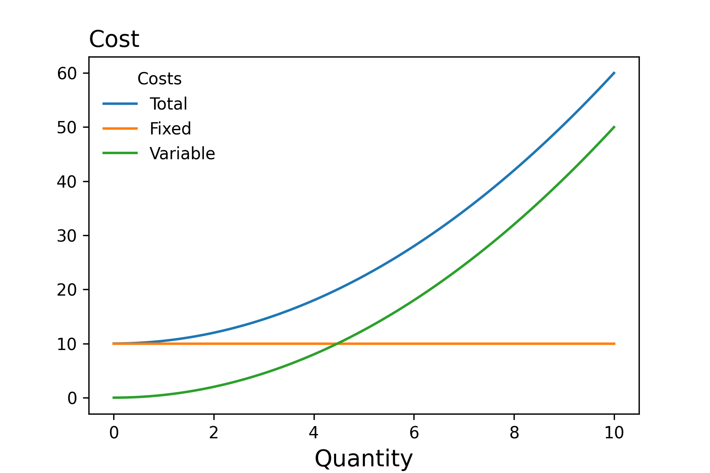
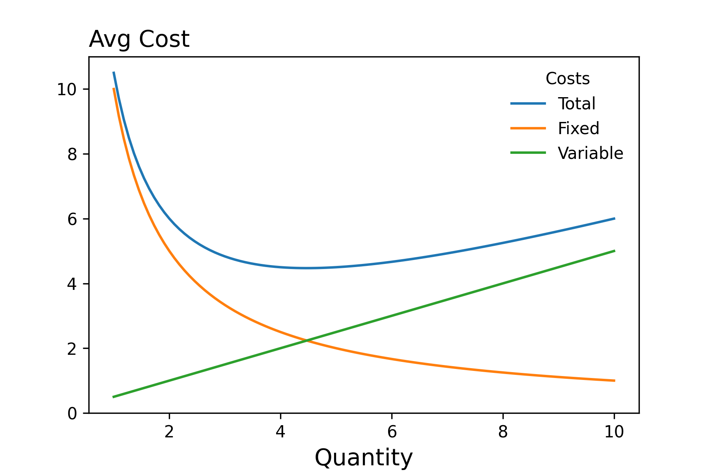
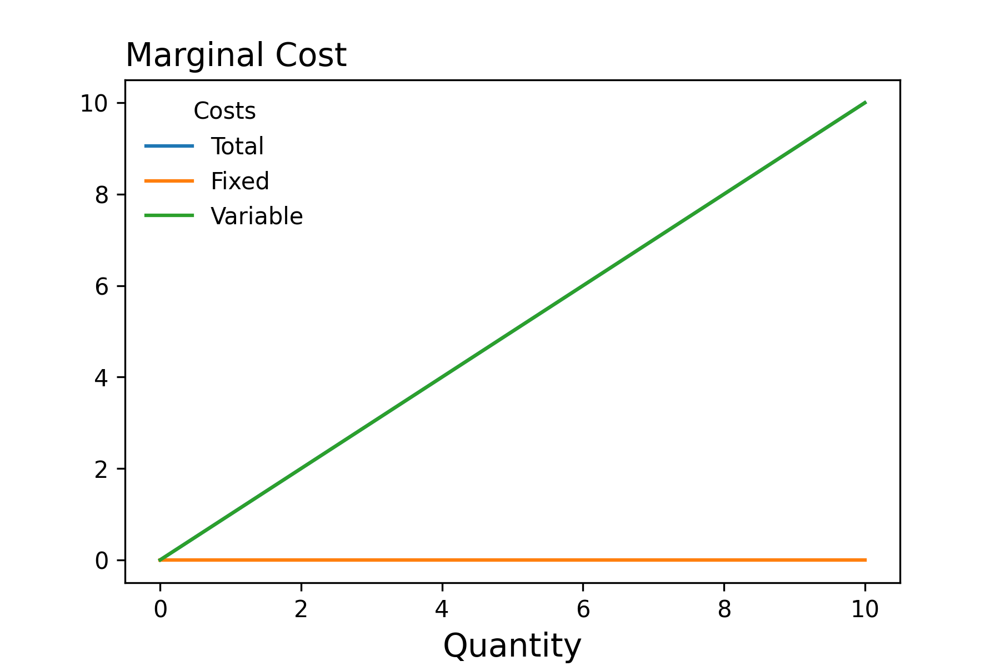
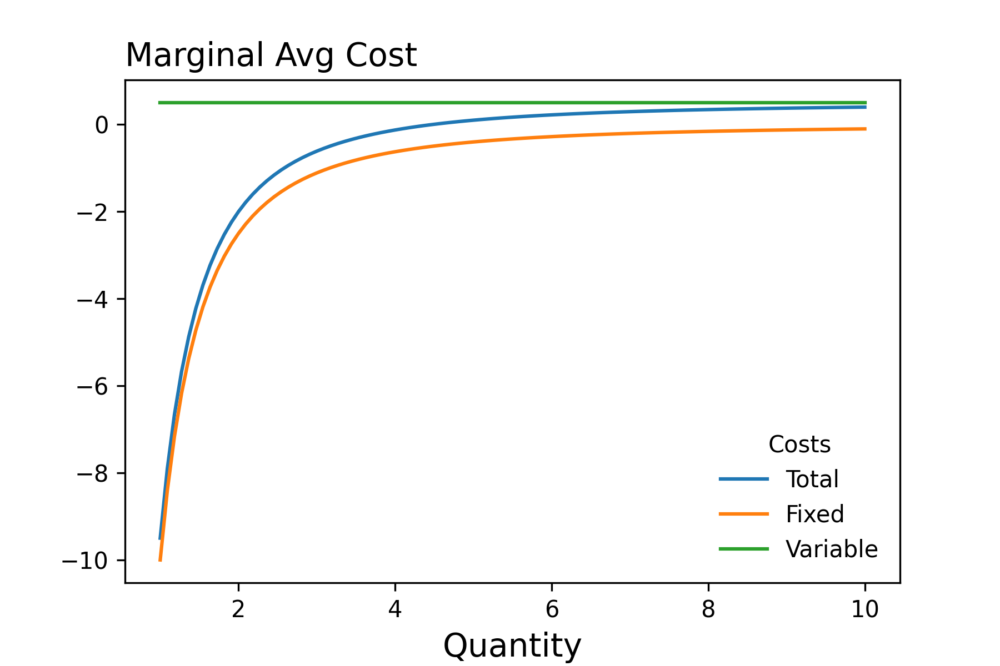

!!! tldr "Overview"

    The aim of this lecture is to illustrate how we can model the firm's behavior

### **Introduction** 

??? question inline end "Consider"

    What else makes modeling the behavior of firms complex? Consider for instance that the actions of the firm today affect its feasibility set tomorrow!

As we've alluded to previously, modeling the behavior of firms can be quite complex. The reason(s) being that a firm's choice set can be quite large. The time horizon that the firm considers can involve multiple periods. And, the demand that they face may be partially unknown. 

Later in the semester, we'll be able to add complexity to our models by considering multiple time periods and thinking through how a firms decisions today affect their choice set tomorrow, and things of that nature. For the moment though, we want to begin my modeling firms as a profit maximizing entity in a single time period where demand is known. 

In this context, the objective of the firm is to make choices in order to maximize their profit.

$$\text{Profit} = \text{Revenue} - \text{Cost}  $$ 

### **Revenue**

Revenue is the price of the good multiplied by the quantity produced. We can express this mathematically, with the help of the inverse demand function, as follows:

$$\textrm{Revenue}(q) = D^{-1}(q)q$$

The inverse demand function is a bit of a long name for a relatively simple relationship. When we talk about the demand function, we mean a function whose domain is prices and whose codomain in quantity. 

$$\text{Demand} :: \text{Prices} \to \text{Quantity} $$

The inverse demand function is the inverse of this function:

$$\text{Inverse Demand} :: \text{Quantity} \to  \text{Prices} $$

Such that the following holds:

$$\text{Demand}(\text{Inverse Demand}(q)) = q $$

Given the revenue function, we can compute the **marginal revenue** by differentaiting the function with respect to quantity.  

$$\text{Marginal Revenue} (q) = \frac{d}{dq}\text{Revenue}(q) = \frac{d}{dq}D^{-1}(q)q + D^{-1}(q)$$

### **Cost**

As with revenue, we can express the cost as a function of the number of outputs: $c(q)$. For instance, we may want to model the cost function as follows

$$c(q) = 10 + 0.5q^2$$

#### Characterizing Costs
- **Variable Costs**: Costs that vary with output -- Ex the wages of mechanics in an auto repair shop
- **Fixed Costs**: Costs that do not vary with output -- Ex the rent/mortage on the auto repair shop

$$\text{Total Costs} = \text{Fixed Costs} + \text{Variable Costs}$$

<figure markdown>
  { width="500" }
  <figcaption>$$c(q) = 10 + 0.5q^2$$</figcaption>
</figure>

??? question 

    If you are given a cost function, how would you compute the fixed and variable costs?

We're often interested in costs per unit of output. As we can see from the figure below, the average fixed costs will decline as we increase quantity. This tells us that as $q$ gets largs, average total costs $\approx$ average variable costs.

<figure markdown>
  { width="500" }
  <figcaption>$$\frac{c(q)}{q} = \frac{10}{q} + 0.5q$$</figcaption>
</figure>

Additionally, you may recall from your Principles of Microeconomics class that the profit maximizing firm chooses output to equate **marginal revenue** equal to **marginal costs**. Below we plot the marginal costs as well as the average marginal costs. 

<figure markdown>
  { width="500" }
</figure>

<figure markdown>
  { width="500" }
</figure>

??? question 

    Let's say that the firm's cost function is as depicted above:

    $$c(q) = 10 + 0.5q^2$$

    If the firm produces $4$ units of output, what is its total cost, fixed cost and variable costs?

We can also model the cost function in terms of the prices of the factors of production by making use of the **production function** which we introduced in a previous lecture. That is the cost function can be defined as an **implicit function** as follows:

$$c(q) = \underset{x_1, x_2}{\text{minimize}} \ w_1x_1 + w_2x_2 \quad \text{s.t.} \ f(x_1, x_2) = q $$

### **Detailed Profit Function**

$$\text{Profit} :: \text{Price of Inputs} \to \text{Inverse Demand Function} \to \text{Production Function} \to \text{Quanity} \to \mathbb{R}$$

The above function signature indicates that the objective function can be thought of as consisting of four arguments: - the prices of the inputs, the inverse demand function that the firm faces in the market, the firm's production function, and the quantity of output to produce. 

??? question "Consider"

    How would you introduce heterogeneity in this context?

#### Example 

Let's assume that we are modeling the company Ford which produces the F-150. Let's further assume that the factors of production consist only of the number of labor hours, $l$ and the number of machines $k$. Then if we know the price of the labor hours $w$, and the rental rate of the machines $r$, the inverse demand function, $D^{-1}$, and the number of F150s that Ford produces, we can comput its profit. 

$$\begin{align*} P_{l, k, D^{-1}} (q) = D^{-1}(q)q - c(q) \end{align*}$$

<!-- 
As we'll see shortly, the production function of the firm is a key aspect that influence the firm's behavior, but it's not t

Firms may have a variety of objectives, but we'll start by modeling them as profit maximizing entities. That is, we'll assume that they make decisions in order to maximize their profit: 
$$\text{Profit} = \text{Revenue} - \text{Cost}  $$ 

As with the utility function, we'll express the profit function as a parameterized function whose domain is the firm's choice set:

??? info "Description" 

    If we want to be more general, then we can express profit as a "curried" function as follows: 

    $$\text{Profit} :: \textrm{Technology} \to \text{Output Prices} \to \text{Input Prices} \to \text{Inputs} \to \mathbb{R} $$

$$ \begin{align*}\text{Profit} &: \textrm{Inputs} \to \mathbb{R} \\ 
\text{Profit}_{f,p,w}(x) &= \langle p, f(x) \rangle - \langle w, x \rangle \end{align*}$$

### **Time** 

We may want to separate inputs into those that are fixed in the short run and those that are not 

$$\text{Profit} :: \textrm{Technology} \to \text{Output Prices} \to \text{Input Prices} \to  \text{Fixed Inputs} \to \text{Variable Inputs} \to \mathbb{R} $$

### **Maximizing Over Inputs**

Above, we formulated the problem of the firm as selecting the output to produce, and we assumed that they knew both the demand and associated cost functions. We could also formulate the problem of the firm as maximizing profit with respect to the input levels. 

$$\underset{x}{\text{maximize}} \ p(f_t(x))f_t(x) - c_w(x)$$

??? info "Bi-level Formulation"

    $$\underset{q}{\text{maximize}} \ p(q)q - \underset{x}{\text{minimize}} \ c(x) \ \text{s.t.} \ f(x)=q $$ -->
