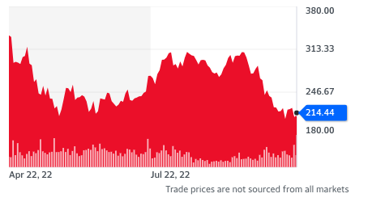

!!! tldr "Overview"

    In this lecture we extend the choice set and utility function to allow us to model agents selecting random variables. 

### **Introduction**

??? note "Presentation Style"

    We all have that friend who prefers to read and understand all the rules before playing a board game. We would usually prefer for that friend to loosen up a bit, though, and just read the main or key rules so that we can get playing more quickly. 
    
    I make this reference because when you are learning probability theory for the first time, it can feel like the instructor is that person who prefers to read all the rules before introducing the applications. You are sitting there in class, wondering why this level of detail is needed, and you asking yourself why we can't just start using this stuff and figure the rest out as we go.

    As you go on to take more classes that make use of or directly teach probability theory, you will come to realize that I am highly selective in the concepts that I have chosen to introduce. We're only scatching the surface of probability theory. And the central focus which motivates the selection of choices is composition. I want to explain ideas at the level of detail so that you can compose them. This is again why I stress the importance of understanding that a random variable is a function!

Up to this point in the course, we have considered "everything" to be known. Like everything. For instance, when modeling how two firms compete where one firm makes a decision before another (the Stackleberg example), we assumed that the firm that moved first knew the market demand function as well as the cost function of its competitor. Now depending on the context and the purpose of the model this might be a reasonable approach, but at the moment it's hard to determine if that true without considering an alternative modeling approach. 

In this lecture we illustrate how to model decisions under uncertainty. We begin with an example buying a share of Telsa stock. As we can see in this [figure](https://yhoo.it/3ABfrFV), the price of tesla moves around quite a bit, so if you bought one share of Tesla today, you wouldn't know the value of the share tomorrow.[^1]

<figure markdown>
  { width="500" }
  <figcaption>Tesla Stock Price</figcaption>
</figure>

To think about this formally, we begin by writing down a probability space, where $\Omega$ represents the set of possible states of the world. 

$$\begin{align*} \Big( \Omega, \mathcal{F}, \mathbb{P}\Big) \end{align*}$$

Given this probability state, we can think of Tesla's stock price as a random variable that maps from $\Omega$ to $\mathbb{R}_+$. That is for any possible state of the world, $\omega \in \Omega$, $X(\omega)$ tells us the price of the Tesla stock. 

Now as previously mentioned, the reason we talk this somewhat formal approach to probability theory is because it highlights the essence of a random variable. Random variables are functions which "pull" the probability measure forward onto the space we care about. For our purpose, we don't care about which state of the world we're in. That has a lot of irrelevant information. For our purpose we only care about the corresponding value of the share price. 

$$\begin{align*} \Big( \Omega, \mathcal{F}, \mathbb{P}\Big) \to \Big( \mathbb{R}_+, \mathcal{B}(\mathbb{R_+}), \mathbb{P} \circ X^{-1}\Big) \end{align*}$$

With this structure in place (and yes I admit there's a lot going on here!), we now want to think about what the consumer knows. Hopefully you can see that thing we really care about $\mathbb{P} \circ X^{-1}$ is the thing the consumer doesn't actually know. That's the probability measure defined over the set of prices that the stock can take. In other words, in reality not only are we uncertain about the price of the share tomorrow, but we're uncertain about the associated probability measure.[^2]  To make some progress, though, we're going to assume that we know the probability measure (again a strong assumption that should be relaxed depending on this context and the reason for the model). 

For example, let's assume that given the current price, the stock is a continuous random variable.[^3] 
- Uniform Random Variable 
- Normal Random Variable

Given this information, how might a consumer value purchasing a share of tesla stock? 

First, if $X$ is a random variable, then the expected value of the random variable is defined as follow, where $f$ is the probability density function.[^4]

$$\mathbb{E}[X] := \int _{\mathbb{R}} x f dx$$

#### Clarification 
 
As you'll begin to understand, the probability space structure contains more information than we sometimes care to consider. For instance, in practice we may not care about $\mathbb{P}$ or $X$ individually, but only together. That is, we may only be interested in the generated probability measure defined on $\mathbb{R}$.

<!-- 
### **Example**

Let's assume that an individual has a home worth $v$ dollars and that with probability $p$ a storm will damage housing causing $z$ dollars worth of losses. In light of this, the consumer can decide whether to buy insurance to cover their house. That is, for each dollar of insurance they purchase, they will receive $k$ dollars if the storm occurs.

??? tip "Notation"

    - We can consider the sample space to be whether or not a storm damaged the house 

    $$\Omega = \{\text{storm}, \text{no storm}\} $$

    - Because the sample space is countable, we can take $F$ to be the power set of $\Omega$ 
    - Then the probability measure defined on $F$ can be expressed as follows:

    $$\begin{align*} \mathbb{P}(\emptyset) &= 0 \\ 
    \mathbb{P}(\{\text{storm}\}) &= p \\ 
    \mathbb{P}(\{\text{no storm}\}) &= 1-p \\
    \mathbb{P}(\{\text{storm}\} \cup \{\text{no storm}\}) &= 1 \\\end{align*}$$

#### Choice Set 

The choice set for the consumer is the amount of insurance to purchase. Prior to seeing whether the storm occurs, they have to decide on the amount of insurance to purchase. 

The choice set could also be thought of as a collection of random variables indexed by the amount of insurance purchased:

$$X_l(\omega)=
\begin{cases}
v - l, \quad \omega = \text{if no storm}\\
v - l - z + kl, \quad \omega = \text{if storm}\\
\end{cases}$$

#### Objective Function (Expected Utility)

$$V :: \text{Utility Functions} \to \text{Probability Measures} \to \text{Random Variables} \to \mathbb{R}$$

$$\begin{align*}V(\mathbb{P}, X_l, U) &= \int U \circ X_l d\mathbb{P}  \\ 
&= \ U(X_l(\text{no storm}))(1-p) + \ U(X_l(\text{storm}))p \\ 
&= \ U(v - l)(1-p) + \ U(v - l - z + kl)p \end{align*}$$ -->

[^1]: The attentive reader will point out that we are not only interested in the price of tesla tomorrow, but also the price over any time interval between today and tomorrow and likely beyond tomorrow. That's true! Good point.

[^2]: Random variables are classified by the probability measure that they induce on the real line -- [reference](https://youtu.be/VsUJwyK9wlo?list=PLbMVogVj5nJQqGHrpAloTec_lOKsG-foc&t=25)

[^3]: ??? tip "Continuous Random Variable"

        Let's consider the following measurable space $(\mathbb{R}, \mathcal{B}(\mathbb{R}))$ and let's take $\mathbb{P}_X$ to be the probability measure generated by the random variable $X$ whose codomain is $\mathbb{R}$. Then $X$ is a continuous random variable if  $\mathbb{P}_X$ is absolutely continuous with respect to the lebesgue measure, which in short is the following condtion 

        $$\forall A \in \mathcal{B}(\mathbb{R}) \ \text{s.t.} \ \lambda (A) = 0 \implies \mathbb{P}_X(A) = 0 $$

        Note, an important point of clarification is that a probability measure may be absolutely continuous with respect to a non-probability measure. 

        If a random variable is continuous, then by the Radon Nikodym Theorem there exists a function $f: \mathbb{R} \to [0, \infty)$ such that the following holds 

        $$\forall A \in \mathcal{B}(\mathbb{R}),\ \mathbb{P}_X(A) = \int_A fd\lambda$$

        Note, if the Borel set corresponds to an interval, then the lesbegue integral corresponds to the Reiman integral that we are familiair with from Calculus 1. We refer to $f$ as the probability density function.

[^4]: ??? tip "Expectation of Random Variables"

        We define the expectation of a random variable as follows.  

        $$\mathbb{E}[X] := \int _{\Omega} X d\mathbb{P}$$

        We can also express the expected value by integrating over the codomain of $X$

        $$\mathbb{E}[X] := \int _{\mathbb{R}} x d\mathbb{P_{X}}$$

        Which via the Radon-Nikodym Theorem is equivalent to the following:

        $$\mathbb{E}[X] := \int _{\mathbb{R}} x fd\lambda$$

    

