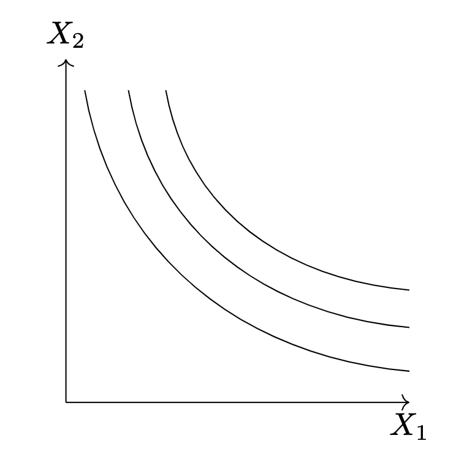

!!! tldr "Overview"

    The aim of this lecture is to illustrate how we can model individual preferences.

### **Preferences**

Intuitively, when thinking about consumer preferences, we're going to assume that preferences are both **complete** and **consistent**. By complete, we mean that if you were to give a consumer two difference choices they could tell you that they stictly prefer one to the other or are indifferent between the choices. By conistent we mean that if they prefer $A$ to $B$ and prefer $B$ to $C$, then they should also prefer $A$ to $C$.[^1]

### **Indifference Curves**
We can visually represent preferences via an indifference curve. An indifference curve is just a set of elements within the choice set that the individual is indifferent between. 

<figure markdown>
  { width="400" }
  <figcaption>Indifference Curves</figcaption>
</figure>

??? question 

    What could happen to the indifference curves if we didn't assume that preferences were complete & consistent?

<!-- ### **Technical** :material-lightning-bolt:

#### Drawing an indifference curve  
What information would you need to draw an indifference curve? Let's say that choice set of the consumer consists of Apples and Oranges, and I give you a specific bundle, say $\{\text{Apples}: 3, \text{Oranges}: 2\}$. What additional information would you need to draw the indifference curve?

You may recall from your calculus course, that if you are given two functions $f, g$ such that $\frac{d}{dx}f(x) = g(x)$, then[^3]

$$\begin{align*}
\int _a ^b g(x) = f(b) - f(a)
\end{align*}$$

Which we can re-write as follows:

$$\begin{align*}
f(a) + \int _a ^b g(x) = f(b)
\end{align*}$$

Then if we are given an initial endowment, $(x_1, x_2)$, and the indifference curve is the graph of the function $f$, i.e. 

$$\text{Indifference Curve}:=\{(x, f(x)) \mid x \in X_1\}$$

Then we can plot the indifference curve (i.e. plot $f$) if we know $g$. -->

[^1]: While it's possible to discuss preferences using the notion of a binary relation over $X \times X$, based on my experience of teaching this course last year, I don't feel like that level of mathematical detail is necessarily helpful.

[^3]: If you haven't seen this before, this is referred to as the first fundamental theorem of calculus. See [here](https://www.youtube.com/watch?v=1RLctDS2hUQ) for a lecture on the topic