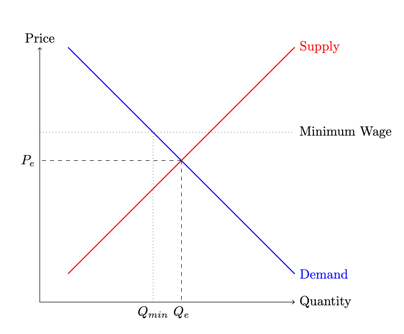

# **Choice**

### Motivation
As we mentioned in the preface, economics is the study of **relationships** that shape/influence/make up the economy. This is an extremely broad set of relationships! To begin to model these relatioinships, we'll often do so by talking about *consumers* and *firms* to keep things clear. 

The way that we're going to model relationships is by considering how one person's action influences the actions of another person. For example, from your Principles of Microeconomic class, you are probably comfortable with the idea that a local government's decision to increase the minimum wage will affect the number of hours an individual works. You could probably sketch down the following diagram to highlight that under a higher minimum wage some workers are likely to benefit (by receiving higher wages), while others are likely to bear the cost of this policy by having to switch to an alternative job or becomming unemployed. 

<figure markdown>
  { width="550" }
</figure>

For many purposes, such a diagram will be more than enough. It's clear, it hights the key aspects, and it makes a striaghtforward prediction. 

In some cases though, depending on the question of interest, we might want to go beyond this model. We might be interested in understanding which types of worker receive the gains versus the loses. Or we might want to consider whether workers respond to the higher wages by working less. Or we might want to determine whether firms increase investment in technology in order to bring down their long run costs. 

To do all this, we'll need to need a framework that allows for complexity of our choosing, which is to say that we'll really need to understand the basics of Economics models. 

### Choice

 in thinking that this, and profit is all that Economists care about. A central focus in this class will be designing economic optimization problems. That is, for a given question of interest, we'll want to decide on an appropriate objective function, constraint function and choice variables. The task of actually solving the optimization problem (searching for a value of the choice variable that is feasible and whose value is the lowest when evaluate by the objective function) is actually an engineering problem. There's no real economics involved.

$$\underset{x \in F^{-1}(0)}{\textrm{minimize}} \ f(x)$$

- Choice Variable : $x \in \mathcal{R}^n$ 
- Objective Function:  $f: \mathcal{R}^n \to \mathcal{R}$
- Constraint Function: $F : \mathcal{R}^n \to \{0,1\}$

The market: 

