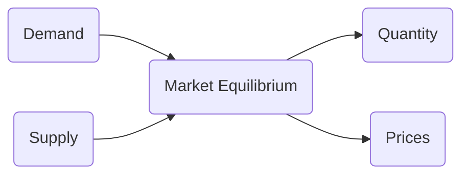

!!! tldr "Overview"

    The aim of this chapter is to illustrate how economic models can be used to understand, explain and assess economic issues/policies.

### **Economics**

??? cite inline end "Partial Understanding"
    Many people have written about the relationship between Economics and the "hard" sciences. While both strive to adhere to the scientific approach, it should be understood that Economic analyses fall well short of this. In Economics, you generally cannot test precise hypotheses without making unsupported assumptions. -- Read [this article](https://www.nytimes.com/2013/10/21/opinion/yes-economics-is-a-science.html) by Raj Chetty for an alternative take though)

Economics is the study of relationships that exists within the economy (relationships between the government and a consumer, between a consumer and a firm, and between a consumer today and a consumer in the future - to name a few). Our understanding of these relationships is **partial**. In part, because these relationships change over time, and in part because we cannot conduct randomized control trials to continuously study these relationships.

### **The Purpose of Economic Models**
When discussing models, I like to emphasize that they are "built". This hopefully keeps in mind that the key aspect of a model is not whether it is **True**, but rather whether it is **useful**. Does it help you:

- [x] Clarify your beliefs/understanding
- [x] Better communicate your beliefs/understanding
- [x] Tests your beliefs/understanding?

To highlight these three distinct roles, we'll consider the exampling of studying the effectiveness of a Right to Counsel (a policy that provides free legal aid to individuals and households facing eviction).

To assess a policy, we need to first decide on a set of relevent outcomes. Writing down a quick economic model can help clarify what those outcomes should be. With the right to counsel, for instance, we might be concerned that it could lead to higher rental prices and maybe lower quantity. If so, we should make sure to collect that data.[^1]

<figure markdown>
  { width="500" }
</figure>

Second, as demonstrated by the above model and the one below, models allow us to succinctly present our understanding or hypothesis about some economic relationship. 

<figure markdown>
  { width="500" }
</figure>

Third, Economic models can be used to assess a policy idea. If you have a near complete understanding of the relationships that make up a model, then you could potentially assess the effect of some new, untested policy.

As you will recall from your Principles of Microeconomics class, economics can 

??? question "Consider"

    Can you construct a model to help you understand an economic relationship?

### **Discussion**

Hal writes in his textbook of the following two principles:
    
- **The Optimization Principle**: People try tp choose the best patterns of consumption that they can afford.
- **The Equilibrium Principle**: Prices adjust until the amount that people demand of something is equal to the amount that is supplied

To what extent is the second principle redundant? Could the first principle be made more general?

### **Where Supply Meets Demand**
- **Information**
- **Time**
- **Incentives**

??? cite inline end "-- Hal Varian"
    A model's power stems from the elimination of irrelevant detail, which allows the economist to focus on the essential features of the economic reality he or she is attempting to understand 

Let's say that we're back in the Spring of 2020 and that we're working for Petco, a company that produces dog food. Our manager comes to us and asks us to model how a shutdown for several months might affect the dog food market.

- **Understand**: Prior to the spring of 2022, we might not ever considered how a partial shutdown of society might affect aspects of the economy. To tackle this question we're going to use a model to "work through" what might happen.

- **Communicate**: Our model will also be a way in which we can communicate our beliefs to others. 

- **Assess**: Our manager might come back to usk to "simulate" how one firm policy might fare compared to another. For instance, they might ask us to determine whether they should shut down some of the production sites.

Let's start with understanding how a partial shutdown might affect things. There'e the demand for dog food -- how much people are willing to pay for it at a given price, and the supply of dog food -- how much firms are willing to produce at a given price. We can represent these two notions succinctly with a [function](./../../math/function).

[^1]: The irony here is that I'm currently working on a paper that studies the effectiveness of a Right to Counsel and I didn't initially take the time to write down a model. As a result, I didn't collect a highly relevant outcome variable (can you guess what it was?). If I had written down the model, it would have been clear that I should collect the variable. 