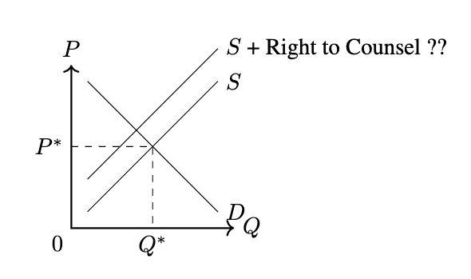
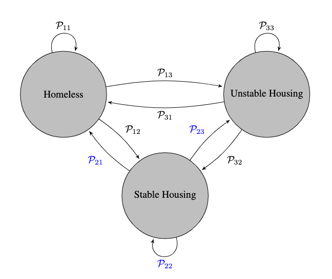

!!! tldr "Overview"

    The aim of this lecture is to illustrate how economic models can be used to understand, explain and assess economic issues/policies.

### **Economics**

Economics is the study of relationships that exists within the economy (relationships between the government and a consumer, between a consumer and a firm, and between a consumer today and that consumer in the future - to name a few). Our understanding of these relationships is **partial**. In part, because these relationships change over time, and in part because we cannot conduct randomized control trials to continuously study these relationships.[^1]

### **The Purpose of Economic Models**
When discussing models, I like to emphasize that they are "built". This hopefully keeps in mind that the key aspect of a model is not whether it is **True**, but rather whether it is **useful**. Does it help you:

- [x] Clarify your beliefs/understanding
- [x] Better communicate your beliefs/understanding
- [x] Tests or evaluate your beliefs/understanding?

### **Economic Model(s) in Action**

To highlight these three distinct roles, let's consider the following scenario where we are tasked with understanding the effects of a Right to Counsel.[^2]

??? question inline end "Question"

    Does the Right to Counsel induce a demand shift?

#### Clarify your beliefs/understanding

To assess a policy, we first need to decide on a set of relevent outcomes by which to judge the policy. If the aim of a Right to Counsel is to decrease evictions, then we should certainly consider evictions as one outcome. But, what else might be affected by the policy? 

To answer this, we can start by replacing the **what** with **who**. Who will be affected by the policy? Whose incentives are shaped or influenced by the policy? Certainly tenants will be, as they receive legal representation. But what about landlords? Would we expect landlords to respond to this policy and if so, how? By listing out a landlord's potential raise (perhaps they (1) exit the rental market (2) raise the rental price (including perhaps the security deposit) we can reason that supply might decrease and therefore that we should look at the effects on price as well.[^3]

<figure markdown>
  { width="500" }
</figure>

#### Better communicate your beliefs/understanding
As highlighted by the above model and the one below, models allow us to succinctly present our understanding or hypothesis about some economic relationship. This is important because conversations or analysis about economic issues is usually done in a team. Someone might have a deep understanding of the context (perhaps as in this case, they work for a rapid rehousing program), another individual might have relavant expertise with the data collection standards and processes (pehaps they work for HUD), still another might be an academic with a background in social psychology who can hypothesize about the extent to which legal representation will be used. With a diverse set of backgrounds, it's important to be able to clearly and succinctly represent beliefs. Doing so will enable people to better understand where their views agree and where they differ. 

<figure markdown>
  { width="500" }
</figure>

#### Tests or evaluate your beliefs/understanding
Third, Economic models can be used to assess a policy idea. If you have a near complete understanding of the relationships that make up a model, then you could potentially assess the effect of some new, untested policy. This exercise of comparing the difference between equilibriums under various market conditions is referred to as comparative statics. 

### **Technical Point** :material-lightning-bolt:
Many of the relationships that we'll want to study have a time component to them. From your Principles of Microeconomics course, you've already worked with models that differ based on time. Presumably, you've looked at short run, and long run models. We want to be able to bring these models together, though. That is, we want to be able to model behavior that is maximizing a per-period objective function summed across a discounted time horizon where actions are limited in the short run and less limited in the long run.[^4] To do so, we'll need to have some basic understanding of probability theory which we'll introduce piece by piece starting shortly!

### **Challenges**

We started this lecture by emphasizing the inherent challenges of studying economic relationships. To add one more piece to this -- a potential source of frustration is that often we don't have enough of a contextual understanding of the problem to provide "precise" predictions. The economic issues that we'll studying can be complex. We'll take as given that people are inherently optimizing to maximize their well-being, but depending on the context, it won't be clear what their beliefs are, the information they posses, or their ability and motivation. In order to produce an estimate or prediction, we'll often have to add "structure"[^5] to the problem. As such, it will be important to explore the extent to which our predictions depend on this structure. 

<!-- ??? question "Why?"

    If your following along with Varian's textbook, you may be wondering why I don't start with a description of the market as done in chapter 1. While the chapter is a worthwhile read, I don't like that it talks about allocation without directly talking about production and that it talks about willingness but omits ability. These terms should generally go together. The chapter ends on a somewhat bizzare note about the fact that rent control is **pareto inefficient** because it doesn't allocate appartments to people with the highest willingness to pay. In my view, this isn't the real issue with rent control (the issue with rent control is the effect is has on the supply in the long run!) and really only serves to highlight a limiation of the notion of pareto efficient. -->

[^1]: This latter point is made by Raj Chetty in [this article](https://www.nytimes.com/2013/10/21/opinion/yes-economics-is-a-science.html).

[^2]: The Right to Counsel is an initiative that aims to combat evictions among low income households by providing free legal representation.

[^3]: The irony here is that I'm currently working on a paper that studies the effectiveness of a Right to Counsel and I didn't initially take the time to write down a model. As a result, I didn't collect a highly relevant outcome variable (can you guess what it was?). If I had written down the model, it would have been clear that I should collect the variable. 

[^4]: Don't worry if you don't understand what this means yet 

[^5]: Structure can be thought of as assumptions with little to know justifications
