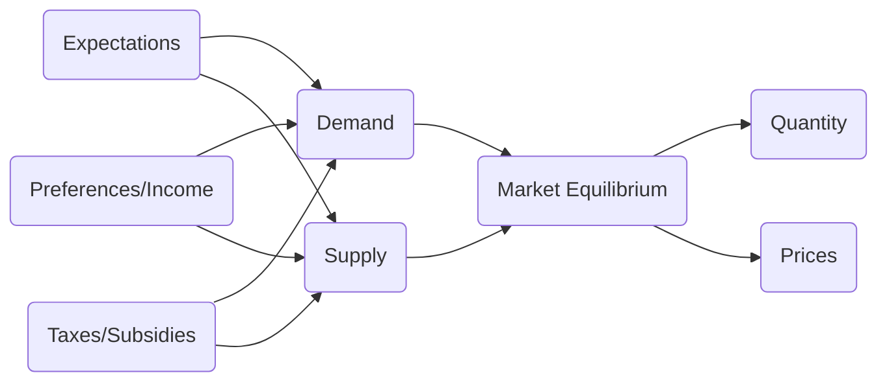

<h1 style="text-align: center;color:#404065;font-weight:bold;">Microeconomic Analysis</h1>

<h2 style="text-align: left;color:#404065;font-weight:bold;">Summary</h2>

A course where we learn how to :hammer_pick: Microeconomic models 

<h2 style="text-align: left;color:#404065;font-weight:bold;">Components</h2>

-   __Real World Events__

    ---

    A central aim in this class is to improve our ability to think critically about the world around us. We'll do so by developing models that focus on recent events, from policy initiatives like the Right to Counsel to broader labor trends like the influence of the pandemic on the supply of teachers.

    ---
    [:octicons-arrow-right-24: Getting started](chapters/real world events/introduction.md)

-   __Optimization__

    ---

    In Economics, we model indviduals, firms, governments as "maximizers". That is, 
    we assume that people can be understood as making decisions to maximize some **objective** function subject to **constraints**.

    ---
    [:octicons-arrow-right-24: Getting started](chapters/optimization/introduction.md)

-   __Uncertainty__

    ---

    Most decisions are made with some level of uncertainty. Firms may be unsure of which competitor may enter the market next year; an employer might not know the type of individual they just hired; consumers are unsure whether a storm will hit their house. In order to capture this uncertainty, we need to make use of probabilty theory.

    ---
    [:octicons-arrow-right-24: Getting started](chapters/Uncertainty/introduction.md)

-   __Math on the Computer__

    ---

    While we'll introduce concepts sequentially in this class, we want to be able to incorporate each aspect into our model. The only way we can do this in a reasonable fashion is by writing our models on the computer. We'll do so by making use of python. 
    
    ---
    [:octicons-arrow-right-24: Getting started](chapters/math on the computer/introduction.md)

<!-- 

- Real World
- Model
- Solver

 -->

  
<!-- 
### **Schedule**

| Date      | Topic | Assignments| 
| :----:  |    :----:   |       :----:  | 
| 09/07   | [Course Overview](overview/overview.md), [Why Model](./chapters/why_model.md) |  |
| 09/09   | [Constraints (1)](./chapters/constraints/constraints_overview.md) |  |
| 09/14   | [Constraints (2)](./chapters/constraints/budget_contraints.md) | Posted Problem Set One |
| 09/16   | [Constraints (3)](./chapters/constraints/exploring_choice.md) |  |
| 09/19   | [Intro Uncertainty](./chapters/constraints/uncertainty.md) |  |
| 09/21   | [Utility (1)](./chapters/objectives/utility.md) |  |
| 09/23   | [Utility (2)](./chapters/objectives/utility.md) | Problem Set One Due  |
| 09/26   | Implicit Functions & Differentiation |  |
| 09/28   | [Technology](./chapters/objectives/production_constraints.md) |  |
| 09/30   | [Profit ](./chapters/objectives/profit.md)  | Draft of Written Response Due  | 
| 10/03   | [Solving Models](./chapters/solving_models.md) | Problem Set Two Posted| 
| 10/05   | Profit Maximization | | 
| 10/07   | [Consumer Heterogeneity](./chapters/slides/conumers.md) | | 
| 10/11   | Midterm Review | | 
| 10/12   | Midterm | | 
| 10/14   | [Demand](./chapters/applications/demand.md) | |
| 10/17   | [Comparative Statics](./chapters/comparative_statics.md) | |
| 10/19   | [Optimal Policy](./chapters/slides/optimal_policy.md)| |
| 10/21   | [Game Theory (1)](./chapters/applications/game%20theory.md) | |
| 10/24   | [Choice Uncertainty (1)](./chapters/slides/choice_uncertainty.md) | [Problem Set 3](https://github.com/pharringtonp19/mecon/blob/main/notebooks/problem_sets/assignments/Problem_Set_Three.ipynb) | 
| 10/26   | [Choice Uncertainty (2)](./chapters/slides/choice_uncertainty.md) | | 
| 10/28   | [Game Theory (2)](./chapters/applications/game%20theory.md) | |
|10/31 | [Math on the Computer](https://github.com/pharringtonp19/mecon/blob/main/notebooks/Problem_Set_4_Preparation.ipynb) |  [Problem Set 4](https://github.com/pharringtonp19/mecon/blob/main/notebooks/problem_sets/assignments/Problem_Set_Four.ipynb) | 
| 11/02   | [Choice Uncertainty (3)](./chapters/slides/choice_uncertainty.md) | | 
| 11/04   | [Choice Uncertainty (4)](./chapters/slides/choice_uncertainty.md) | | 
|11/07 | [Asymmetric Information (1)](./chapters/markets/information.md) |  [Problem Set 5](https://github.com/pharringtonp19/mecon/blob/main/notebooks/problem_sets/assignments/Design_Your_Own_Market_Correction.ipynb) | 
| 11/09  | [Mathematics of Equilibrium](./chapters/markets/information.md) | | 
| 11/11  | [Asymmetric Information (2)](./chapters/markets/information.md) || 
| 11/14  | [Asymmetric Information (3)](./chapters/markets/information.md) | | 
| 11/16  | [Asymmetric Information (4)](./chapters/markets/information.md) || 
| 11/18  | Midterm Review || 
| 11/21  | Midterm | |  -->

