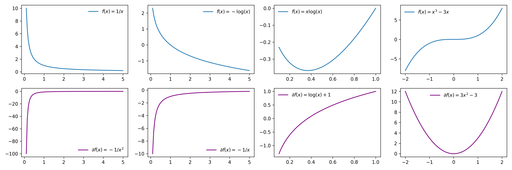

### **Introduction**

!!! tip 

    We can reason locally about a function by using First Order Taylor Polynomials 

We want to consider the following problem: 

$$\begin{align*} \underset{x \in G(\mathbb{R}^n)}{\text{minimize}} \ f(x) \end{align*}$$

#### Notation
- $f$ is the objective function

- $\mathbb{R}^n$ is the domain of $f$

- $G$ is a set-valed function that maps the domain of $f$ into a subset of $\mathbb{R}^n$

- We can express $G$ in terms of a constraint function $c$:

\begin{align*}
G(\mathbb{R}^n) := \{x \ \mathbb{R}^n \mid c(x) = 0\}
\end{align*}

- $x \in \mathbb{R}^n$ is the choice variable

### **Local Minimium**

Roughly speaking, a point, $x_0$, is a local minimum of a function, $f$, if for every point in the ***feasible neighborhood*** of $x_0$, $f(x) \geq f(x_0)$.

More formally, we can say that $x_0 \in G(S)$ is a local minimum if the following condition holds:

\begin{align*}
\underbrace{\exists \ \varepsilon > 0 \ s.t. \ \forall x \in G(S) \ s.t. \|x-x_0\| < \varepsilon}_{\textrm{feasible neighborhood: open ball around} \ x_0}, \quad f(x) \geq f(x_0), 
\end{align*}

<figure markdown>
  { width="1000" }
  <figcaption>Functions</figcaption>
</figure>

### **Searchable Conditions**

Now that we have a conceptual understanding of what a local minimum is (note this definition holds for both constrained and unconstrained problems) we would like to express the criteria of a local minimum in a way so that we can search for it. That is we want to make this definition mathematically tractable. We do so by making use of the First Order Taylor Polynomial around $x_0$.

\begin{align*}
f_{x_0}(x) &= f(x_0)  + \nabla f(x_0)'(x-x_0)
\end{align*}

From the definition of a local minimum, it's clear that if $x_0$ is a local minimum, then the  condition, $f(x) \geq f(x_0)$, must hold when $x$ is very close to $x_0$. Hence, when reasoning about $f(x)$ in some small neighborhood around $x_0$, it is sufficient to reason about $f_{x_0}(x)$. 

Therefore, if $x_0$ is a local minimum, then for any feasible $x$ in a small neighborhood of $x_0$

\begin{align*}
f_{x_0}(x) &\geq f(x) \\
\iff \quad f(x_0)  + \nabla f(x_0)'(x-x_0) &\geq f(x) \\
\iff \quad \nabla f(x_0)'(x-x_0) &\geq 0
\end{align*}

#### Unconstrained 
If there are no constraints, then the feasible set is $\mathbb{R}^n$. Hence we can re-write the above condition as saying 

\begin{align*}
\nabla f(x_0)'d \geq 0 \quad \forall d \in \mathbb{R}^n, \|d\| \ll 1
\end{align*}

Take $d =  -\nabla f(x_0)/k$ where $k$ is some sufficintly large scalar such that $\| -\nabla f(x_0)/k\|  \ll 1$. Thus we found a $d$ where::

\begin{align*}
\nabla f(x_0)'d &= \nabla f(x_0)'\nabla f(x_0)\Big(\frac{-1}{k}\Big) \\ 
&= \|\nabla f(x_0)\|^2\Big(\frac{-1}{k}\Big) \\
&\leq 0 
\end{align*}

Hence, we can conclude that if $x_0$ is a local minimum and there are no constraints, then $\nabla f(x_0)=0$.

#### Constrained 

With a constraint function, the feasible set is no longer $\mathbb{R}^n$. Hence we can re-write the above condition as saying 

\begin{align*}
\nabla f(x_0)'d \geq 0 \quad \forall d \in \mathbb{R}^n, \|d\| \ll 1, d \ \textrm{is a feasible direction}
\end{align*}

1) If $x_0$ is a local minimum, it must be feasible and hence $c(x_0) = 0$. Therefore the first order taylor polynomial of the constraint function around $x_0$ is the following: 

\begin{align*}
c_{x_0}(x_0 + d) &= \underbrace{c(x_0)}_{=0}  + \nabla c(x_0)'d\\
&=\nabla c(x_0)'d
\end{align*}

2) If $d$ is feasible direction (i.e. $c_{x_0}(x_0 + d) = 0$, then 

\begin{align*}
c_{x_0}(x_0 + d) &= 0 \\ 
\iff \nabla c(x_0)'d &= 0 
\end{align*}

3) But **note** if $d$ is a feasible direction then $-d$ is also a feasible directiion, which means we can actually tighten the above constraint even further to say that $\nabla f(x_0)'d = 0$ 

If $x_0$ is local minimum of $f$ then $\nabla f(x_0)'d = 0$ for all $d$ such that $\nabla c(x_0)'d = 0$. This just means that if $x_0$ is a local minimum, then $\nabla f(x)$ is parallel to $\nabla c(x_0)$. i.e. 

\begin{align*}
\nabla f(x_0) &= \lambda \nabla c(x_0), \quad \textrm{for some} \ \lambda \\
c(x_0) &= 0 
\end{align*}

#### References

  - [Stephen Boyd](https://www.youtube.com/watch?v=Ry5i8DGZrJs&list=PL3940DD956CDF0622&index=5), [Coursera](https://www.google.com/search?q=necessary+and+sufficient+conditions+local+minimum&biw=939&bih=674&tbm=vid&sxsrf=AOaemvL11vJ6KYgxSjmDFhtXAuisr1Td2Q%3A1632345955007&ei=Yp9LYYn0PMbM_AbF0LnYBg&oq=necessary+and+sufficient+conditions+local+minimum&gs_l=psy-ab-video.3...6810.12008.0.12290.17.17.0.0.0.0.186.1820.1j13.14.0....0...1c.1.64.psy-ab-video..3.13.1710...0i512k1j0i390k1j0i67k1j0i22i30k1j33i22i29i30k1j0i333k1.0.bg_Bf2HIKKs)
